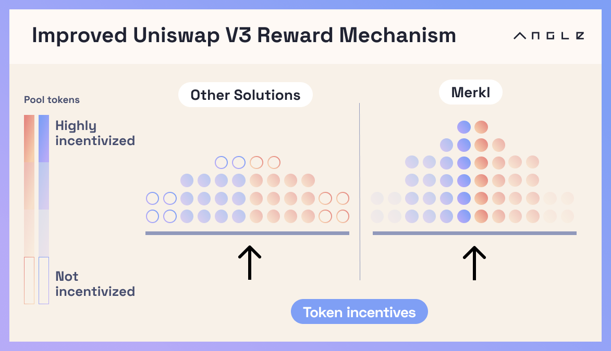

# 🥨 Merkl Overview

Merkl is a mechanism to incentivize any type of complex onchain behavior, it is built and maintained by Angle Labs, but is separate from the Angle Protocol. It can not only replicate any type of staking contract, it can also do much more and reward in a tailored manner any onchain action, or combination of actions.

Incentives are distributed by deploying **Merkl Campaigns** in which incentivizors select a token to distribute, an amount of that same token and a timeframe over which the token should be distributed. All Merkl campaigns can be found by visiting the [Merkl App](https://merkl.angle.money).

While the set of onchain behaviors is infinite, **Merkl provides the ability to add custom rules to every campaign such as:**

- only rewarding users which matched the eligibility criterias for a set amount of time
- boosting rewards of the users which hold a specific token
- blacklist or whitelist some addresses for every campaigns

Merkl supports many more custom rules which are specific to the type of onchain behavior which is incentivized, it can currently reward:

- liquidity providers on concentrated liquidity protocols
- holders of a specific ERC20 token for a given amount of time (just like in a staking contract)


We are working hard to support more behaviors (lenders and/or borrowers of a specific token on a lending market, users of perp DEX protocols, etc.) and to add new rules to existing behaviors.


A key feature of Merkl is its ability to trace user activity across protocols. This feature enables users to accrue rewards even if the incentivized asset isn't directly present in their wallet, the rewards which would have been accrued by a smart contract holding the incentivized asset are forwarded the user which deposited tokens in it (see [Merkl Forwarders](merkl-mechanism#merkl-forwarders))


For example, when an ERC20 holder stakes the ERC20 token in a staking contract, the address of the user no longer holds the incentivized ERC20 token. Merkl will detect ERC20 tokens held by the staking contract and forward the rewards to the original user.


In short, this solution is conceived as an agnostic powerhouse enabling everyone to unlock liquidity based on their exact needs without overspending or allocating tokens to reward behavior/users/actions that are not beneficial to the incentivizor. For example, Merkl is much more efficient at shaping liquidity on concentrated liquidity pools than the other solutions available on the market.

Earning rewards on Merkl incurs **no risk of funds** and requires no specific smart contract interactions for the users: they will only interact with Merkl contracts to claim their rewards.

Merkl has a low maintenance fee applied to incentives distributed. Excluding gas when claiming rewards, there is no cost to use the platform for Liquidity Providers.

## Supported chains

Merkl is live on the following chains:

- Ethereum mainnet
- Arbitrum
- Polygon
- Polygon zkevm
- Base
- Optimism
- Gnosis
- Core
- Thundercore

## ⚱️ Fee Structure

Merkl is free to use for liquidity providers claiming rewards. There is a maintenance fee of 3% applied to incentives that are sent by incentivizors. This fee can be descreased for large incentivizors.

This fee can be waived for pools which contain some specific approved tokens. In particular, there are no fees for incentives sent to pools which have agEUR.
