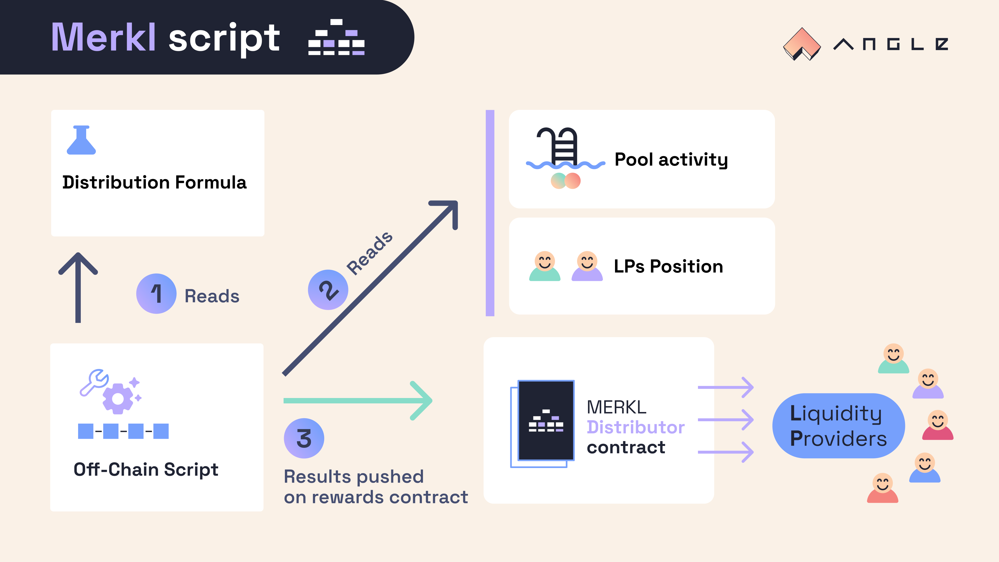

# Concentrated Liquidity Mechanisms

## 💪 Reward distribution formula

For a given pool with two tokens (A and B), the script looks into the swaps that took place on the pool during the period for which it is ran and computes a reward score for each position according to:

- the fees earned by the position during the period, which represent the liquidity of the position used by the pool
- the amount of token A held by the position during swaps on the pool compared to the total amount of token A in the pool
- the amount of token B held by the position during swaps on the pool compared to the total amount of token B in the pool

A different weight, chosen by the incentivizor, is attributed to each parameter. On top of that, incentivizors can further customize the distribution of the rewards for the pool by optionally allowing addresses holding a specific token (veANGLE or veCRV for example) to earn boosted rewards.

The exact distribution formula for a position in such a pool during a time period is as follows:

$$
[w_{\texttt{fees}} \times \frac{\texttt{fees by position}}{\texttt{fees by pool}}+ w_{\texttt{A}} \times \frac{\texttt{A in position}}{\texttt{A in pool}}+ w_{\texttt{B}} \times \frac{\texttt{B in position}}{\texttt{B in pool}} ] \times \texttt{optional gov token boost}
$$


For big pools with a lot of swaps, the script may not look at data from all the swaps that occurred during the given time period, but only sample the biggest ones.



While Merkl can incentivize any type of liquidity providers, the system comes with an anti DoS filter and only rewards addresses with more than \$20 worth of liquidity in their position.


### 🧳 Liquidity Position Managers

Merkl is compatible with liquidity position managers (or ALMs) actively maintaining positions for LPs on concentrated liquidity AMMs. The way the script works for such managers (or wrappers) is that it does not differentiate managers from other "normal" addresses when computing rewards. It then splits the rewards going to the position manager address proportionally between all holders of its token.

With Merkl, if you incentivize a pool that is compatible with one of the liquidity managers supported by the system, it will be automatically detected by the script and users indirectly providing liquidity through those position managers will be able to directly claim their rewards from Merkl contracts.

As the system is offchain, new types of position managers can easily be added into the system. For instance, it would be possible to reward users of protocols that use position manager tokens on other contracts, as a collateral to borrow for example.


The list of liquidity position managers supported for each AMM and chain can be directly found on the incentivized pools on [Merkl app](https://app.merkl.xyz). If you want to add support for a type of liquidity position manager that is not supported or directly reward the underlying users of a smart contract that indirectly controls AMM liquidity, fill [this form](https://tally.so/r/w4JYLr) and drop a message on the Merkl channel of the [Angle Discord server](https://discord.gg/tZPwmgqH).

