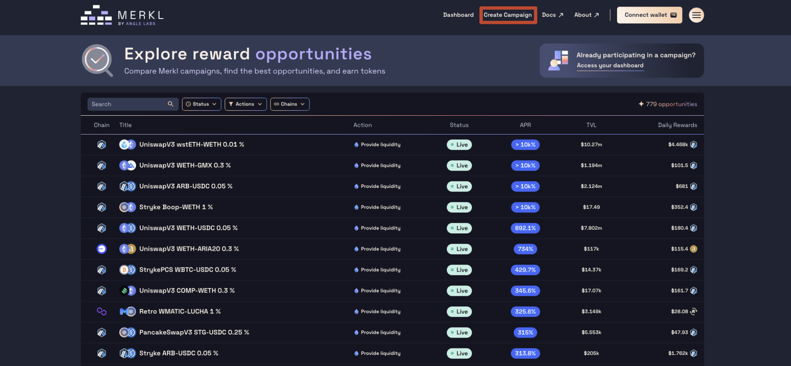
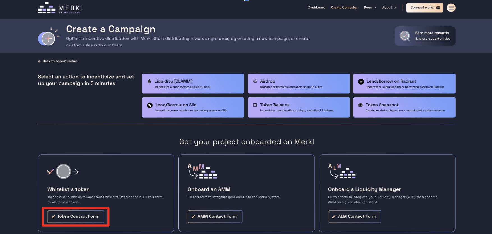
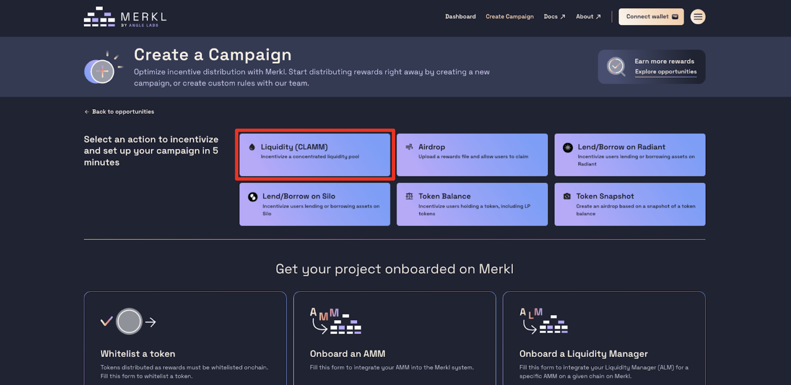
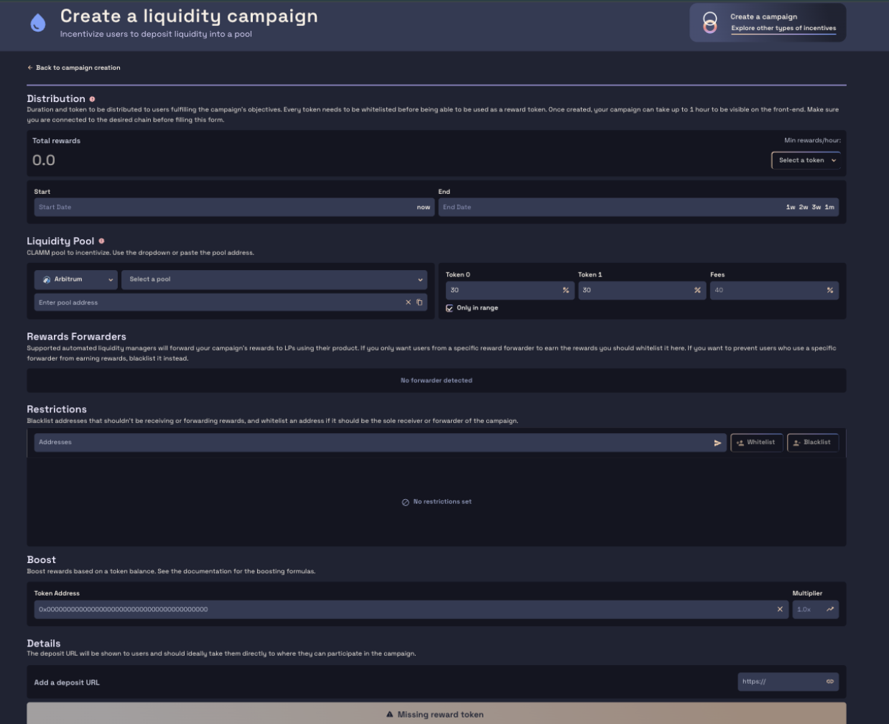
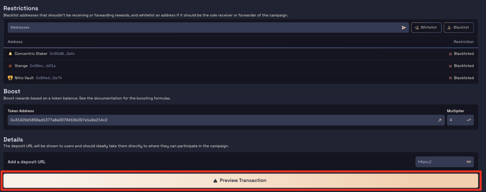
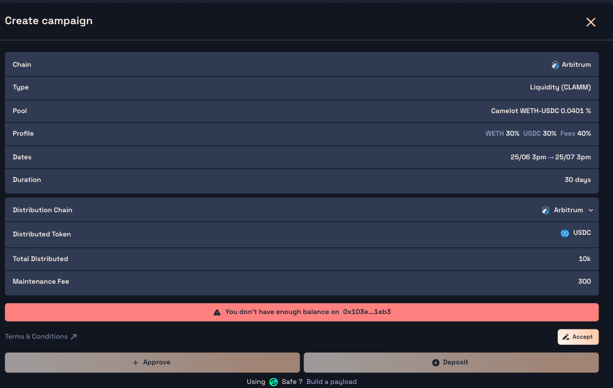

# 😽 Distribute with Merkl

Merkl is a one-stop shop for running all your incentive and growth campaigns and it only takes a few clicks and minutes to get started!

Merkl campaigns can be created at the smart contract level directly or through the Merkl frontend available [here](https://app.merkl.xyz/create), which lists the supported campaign types.

Merkl supports several big campaign types, which can all be customized with various hooks or enriched with other properties:

1. Campaigns for liquidity providers in Concentrated Liquidity Pools (CLAMM) such as on Uniswap V3
2. Campaigns to incentivize holders of an ERC20 token over time (ERC20 Campaigns), which can include campaigns to incentivize lenders and borrowers of lending protocols that uses receipt tokens, or liquidity providers in constant product liquidity pools (like Uniswap V2 or Aerodrome V2)
3. Campaigns to incentivize Lending and Borrowing on more complex protocols like Morpho, or to incentivize more tailored behavior on lending and borrowing protocols that we support notably on Silo and Radiant
4. Campaigns to airdrop tokens to a wide range of users based on a json file or on a snapshotted token balance


We are constantly working on adding support for new campaign types. This list as well as the following pages may therefore not be fully up to date with what's currently supported by the Merkl engine and frontend. If you're interested in a new incentivization use case, don't hesitate to contact us by opening a [BD ticket on our Discord](https://discord.com/invite/jnYfrGxDbe)



If you are looking to run a points program and want to leverage Merkl for this, please contact us so we can provide guidance on how you can easily leverage Merkl to reduce the operational hassle for your team for this.


## Getting started

### Token whitelisting

Before starting your campaign, you need to ensure that the token you want to use as reward with Merkl has been whitelisted. We usually process token whitelisting requests once a day, and it's a way for us to ensure that we will be able to properly compute APRs and that the token will be safe to use for our users.

You can find all whitelisted tokens by chain on this [page](https://app.merkl.xyz/integrations). If your token is not part of the list, please fill out the following [form](https://tally.so/r/3y2bqx).

### Understanding the Merkl engine

It's also important to understand how the Merkl engine works. The engine calculates and distributes rewards based on the parameters you set for incentivizing liquidity providers.

The Merkl engine runs at different frequencies depending on the chain, typically every 4 to 12 hours (with an average of 8 hours). You can check the status for each chain in our app [here](https://app.merkl.xyz/status).

For example, if you create a 14-day campaign with a budget of $42,000, and the engine runs every 8 hours (3 times per day), there will be a total of 42 runs (14 days × 3 runs per day). As a result, the rewards per run would be $1,000 ($42,000 ÷ 42), i.e farmers will be able to claim $1,000 from the rewards you allocated at each engine run.


For more details on the Merkl system, you can check [this page](../mechanisms/technical-overview.md) of our docs.


### Understanding the specificities of your campaign type

It's key to understand how the specific campaign you'll be running works. This [section of the docs](../mechanisms/types-of-campaign.md) details some of the specificities associated with all the specific Merkl campaigns.

Typically, if you create a concentrated liquidity campaign, you'll need to understand the different parameters for concentrated liquidity pools campaigns.

Again, if you're looking for some incentive mechanism for which you're not sure about whether it's supported or looking to add incentive features or hooks that are not displayed on the platform, please contact us!

## Step-by-step process


The Merkl Campaign creation page contains an extended FAQ that may be helpful if you encounter any issue while creating a campaign.


1. **Access the Campaign Creation Page**
   Go to the Merkl App and go to the campaign creation section by selecting _Create Campaign_ from the dashboard.

<figure><figcaption></figcaption></figure>

2. **Verify if your token is whitelisted**

After clicking on the _Create Campaign_, this will redirect you to the page below. If not already whitelisted (you can check [here](https://app.merkl.xyz/integrations) whitelisted tokens on a given chain), fill out the whitelisting form.

<figure><figcaption></figcaption></figure>

3. **Connect your Wallet**

Connect your wallet and select the chain on which you want to distribute the rewards. **The chain connected to your wallet during the campaign creation will determine where the rewards are distributed, but not necessarily where you'll be incentivizing activity.** To see all the chains that Merkl supports, check this [page](https://app.merkl.xyz/integrations).

4. **Select your campaign type**

Once your token is whitelisted, you can choose your specific campaign type by clicking on the appropriate button (see screenshot below).

<figure><figcaption></figcaption></figure>

5. **Fill Out Campaign Details**

<figure><figcaption></figcaption></figure>

You will then be redirected to the campaign configuration page. The details you will need to provide depend on the campaign type you have chosen.

In many campaigns, you will be required to input a rewards amount as well as start and end dates for the campaign. The total rewards amount is the total amount of rewards to be distributed over the whole campaign duration (on top of which a maintenance fee may be applied).

For each whitelisted token, Merkl sets a minimum amount of token that can be distributed per hour. If your token amount is too low (generally parameters are calibrated so that you cannot distribute less than \$1 per hour), then you will not be able to create your campaign.


For some campaigns, you might be wondering why there are so many parameters. The reason is simple: we want to empower you to incentivize the exact behavior you desire. This flexibility is at the core of Merkl—enabling anyone to incentivize the onchain behavior they want!


While the Merkl frontend usually detects the protocols incentivized and will automatically link to the right frontend associated with the opportunity, campaign creators may provide onchain the deposit URL where users can participate in the campaign.

6. **Customize your campaign with hooks**

Campaigns on Merkl are fully customizable, and you may typically have to decide whether to modify the default behavior for the campaign.
Some of the hooks supported on Merkl are detailed [here](../mechanisms/hooks/README.md). You may typically choose to:

- boost rewards for holders of a given token (following the Curve formula or your own formula)
- whitelist eligible addresses for rewards
- blacklist addresses from receiving rewards. Usually incentive providers tend to blacklist contracts that they own and can control large amount of the incentivized tokens, or addresses that are not capable of claiming rewards or that they simply don't want to reward
- only allow people who have used a particular bridge to get funds on a chain to receive rewards.
- enable users who put liquidity in some specific smart contracts to receive rewards even if they're not directly involved with the pool or the token incentivized. This is typically useful if liquidity can be staked in other smart contracts. Within this hook, you'll be asked to specify the recipient of the initial rewards (i.e., the contract where users initially staked their tokens) and the token to forward rewards to (i.e., the ERC20 token contract that issues tokens when staking and to which the rewards will be forwarded to the users holding such staked tokens). Most of the time it'll be the same contract and you'll need to input the same address twice
- And more!

Some hooks are also campaign specific. In concentrated liquidity campaigns for instance, you have the choice to leave the opportunity for out of range positions to still accrue rewards.

7. **Preview Transaction and Submit**

Double-check all the information entered for accuracy. Once you have finished configuring your campaign, proceed by pressing the _Preview Transaction_ button.

<figure><figcaption></figcaption></figure>

8. **Sign and Submit**

You can sign and submit using either an EOA account or a multisig wallet. The recommended method for distributing rewards with Merkl using a multisig is through the Gnosis Safe Transaction Builder. Regardless of the method you choose, you will need to follow these steps: accept the T\&C, approve the tokens for transfer, and deposit them.

- **Using an EOA Account:**
  - Double-check your campaign configuration.
  - Read and accept Merkl's T\&Cs by clicking on the _Accept_ button and signing using your wallet.
  - Approve the tokens for transfer and deposit the amount you want to incentivize, plus the maintenance fee of 3%.

<figure><figcaption></figcaption></figure>

After these steps, congratulations! You have created your Merkl Campaign!


Please note that once created, your campaign may take up to one hour to become visible on the front-end.


- **Using a multisig wallet (Safe Wallet):**

The recommended method for distributing rewards with Merkl using a multisig is through the Gnosis Safe Transaction Builder.

To learn how to deploy your campaign from a multisig or Gnosis Safe Transaction Builder, check this [page](./deploy-your-campaign-from-a-multisig-or-gnosis-safe.md) where everything is explained in more detail.

## Campaign specific details

Depending on your campaign type, you may be asked to provide specific information.

To understand what this specific information may relate to, please refer to the page associated with the campaign type or the wider campaign category [in the doc](../mechanisms/types-of-campaign.md). These pages should explain in details what each parameter required from you is about.


While you may see various campaign types associated with some lending or borrowing protocols, if a lending protocol or a constant product AMM doesn't have its own card in the campaign creation page of the Merkl frontend, you may still incentivize it directly on Merkl using the **ERC20 Campaign** type.

