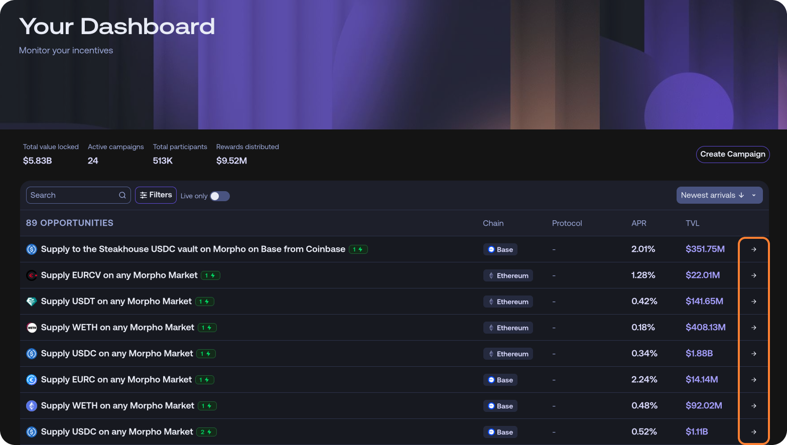
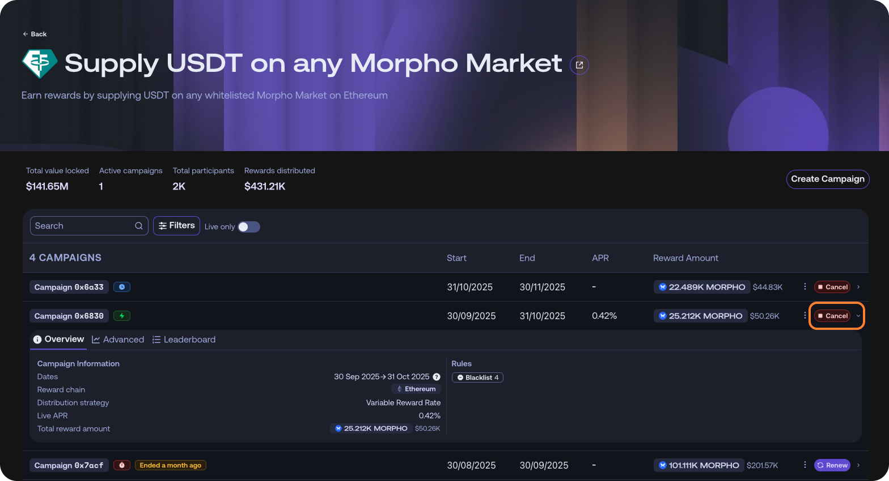
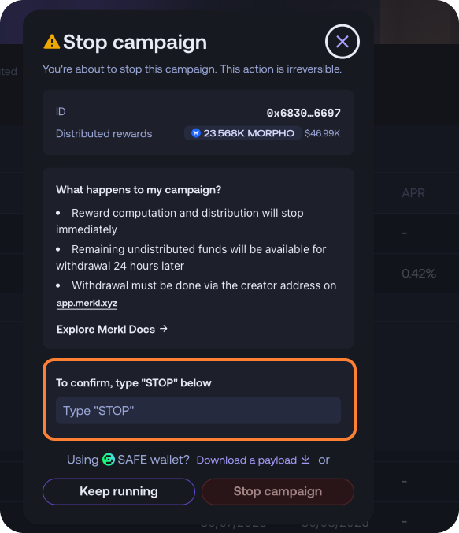

# Campaign Management

As a campaign manager, you have full control over your campaigns and can perform several actions on your live campaign.

The Merkl Studio is where campaign managers can monitor and manage their campaigns.

<figure><figcaption><p>Dashboard view in Merkl Studio</p></figcaption></figure>


The Studio also helps you monitor campaign performance and track key metrics like APR and TVL. For advanced analytics and programmatic access, use the [Merkl API](../integrate-merkl/app.md).


## 🛑 Campaign Cancellation

You can cancel live campaigns and recover undistributed rewards at no cost.

To cancel a campaign, open [Merkl Studio](https://studio.merkl.xyz/users/) and sign in with the manager address. If you only need the cancellation transaction payload (e.g., for a Safe), you may impersonate the manager address to fetch it.

**Step 1:** From the Opportunities list, open the opportunity that contains your campaign.

<figure><figcaption></figcaption></figure>

**Step 2:** Select the campaign and click Cancel on the right.

<figure><figcaption></figcaption></figure>

**Step 3:** Confirm the action by typing STOP when prompted. You can then execute the cancellation transaction. If you prefer to execute via a Safe, download the payload and drag it into the Safe Transaction Builder.

<figure><figcaption></figcaption></figure>

Once canceled, the campaign stops accruing rewards immediately. Undistributed tokens become withdrawable within **24 hours**—either from the Merkl UI or directly by calling the contract.


Cancellation is **irreversible**. The engine will not process further updates for this campaign, and previously processed distributions remain final.


## ✏️ Campaign Overrides

Merkl allows campaign managers to modify active campaigns by adding customization options, such as:

* Adjusting blacklists or whitelists to include or exclude specific addresses
* Enabling additional features as needed
* Changing start and end dates if they haven't passed yet

❌ What You Cannot Do:

* Change the reward token
* Change the end date to a date in the past
* Change the total reward amount
  * To **reduce** the total amount: Cancel and recreate a new campaign. If you want identical dates, **offset** either the start or end by **at least 15 minutes** to avoid campaign duplication in the Merkl engine.
  * To **increase** the total amount: Create an **additional campaign** running in parallel. In the Merkl app, opportunities with **2+ lightning icons** indicate multiple active campaigns.


**Adding extra rewards or new reward tokens**

To add extra rewards or a new reward token to an existing campaign, create an additional campaign on top of the current one. The new campaign must have a slightly modified start or end date (minimum one hour difference) to prevent campaign duplication in our engine.


## 🔄 Campaign Reallocation

As a campaign manager, you can reallocate unclaimed rewards from any recipient address to another address at your discretion. This gives you full control over reward distribution, especially when certain addresses cannot claim their rewards.

Once a campaign has ended, you can reallocate unclaimed rewards from specific recipients or reallocate all unclaimed rewards at once.

To give users time to claim their rewards, reallocation is only available after a defined window following the campaign's end. Currently, this window ranges from 1 day to 7 months post-campaign.

When reallocation is triggered, the process can take up to 24 hours. This delay is due to required security checks and the need to publish a Merkle root onchain—an essential step for making the reallocated rewards claimable. Since Merkle root updates are not continuous or real-time, this contributes to the processing time.

Once the reallocation is complete and the Merkle root is updated on the relevant chain, the reallocated rewards become claimable just like any other Merkl reward, using the address to which they were reassigned.

### Use Cases

* Smart contracts without claim functions that need rewards redirected to claimable addresses
* Lost wallets or inaccessible addresses
* One-time partner facilitation (redirecting from contract addresses to partner wallets)

Campaign managers can perform reallocations either through the [Merkl Studio](https://studio.merkl.xyz/users/) interface or programmatically via the smart contract.

**How to Reallocate Rewards:**

Call the `reallocateCampaignRewards` function on the Campaign Creator contract:

```solidity
function reallocateCampaignRewards(
    bytes32 _campaignId,
    address[] memory froms,
    address to
)
```

**Parameters:**

* `_campaignId`: The campaign ID for reallocation
* `froms`: Array of addresses to reallocate from (use `["0x0000000000000000000000000000000000000000"]` to reallocate all unclaimed rewards)
* `to`: The destination address

**Example Transaction Payload** (for use with Safe Transaction Builder):

When reallocating from the same address across multiple campaigns, create multiple transactions in your Safe batch—one for each campaign ID:

[Download example payload file](../.gitbook/assets/reallocation-payload-example.json)

This example shows how to batch reallocations from the same source address to the same destination address across multiple campaigns. Add more transaction objects to the `transactions` array for additional campaigns.

**Important Considerations:**

* Reallocation can take up to 24 hours to complete due to security checks and processing
* **No fees are charged for reallocation operations**
* Each campaign must be reallocated separately (but can be batched in a single Safe transaction)