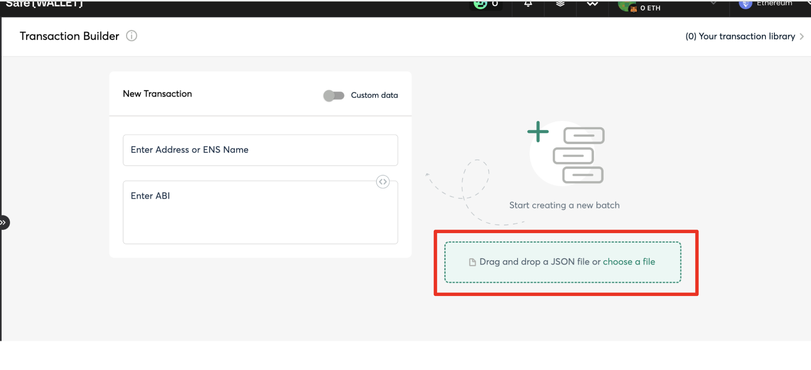

# Create a Campaign from a Multisig or Gnosis Safe

The recommended method for creating campaigns with Merkl using a multisig is through the Gnosis Safe Transaction Builder.

This guide walks you through generating and executing the payload to finalize your campaign creation.

## 1. Configure Your Campaign and Get Your Payload

**For simple campaigns:**

Follow [our guide](./create-a-campaign.md) to use Merkl Studio to configure your campaign. 

Once your configuration is complete, download your payload by clicking on _Using_  _SAFE wallet? Build a payload_ at the bottom of the last campaign creation step.

<figure><figcaption></figcaption></figure>

**For multiple or advanced campaigns:**

If you're creating multiple campaigns at once or prefer a programmatic approach, refer to [this guide](./create-multiple-campaigns.md).

## 2. Upload the JSON File

Once you have your JSON payload file, open the Gnosis Safe Transaction Builder and either drag and drop the file into the designated area, or click _Choose a file_ to upload it manually.

<figure><figcaption></figcaption></figure>

If you're using a different tool, proceed with your standard workflow.

## 3. Execute the Transactions

You will see the following 3 transactions:

* `approve`: Approves the MerklDistributor contract to spend your reward tokens
* `acceptConditions`: Accepts Merkl's Terms & Conditions. This is required the first time you create a campaign but can be removed from subsequent payloads.
* `createCampaign`: Creates the campaign

<figure><figcaption></figcaption></figure>

Click _Create Batch_ and then _Send Batch_ to execute the transactions and deploy your Merkl campaign.

Congratulations! You have successfully created your Merkl campaign.


Campaigns typically appear in the Merkl app within approximately 1 hour. You can view the latest created campaigns in [this filtered view](https://app.merkl.xyz/?sort=lastCampaignCreatedAt-desc&tokenType=all).


## Recommendations

**Optimize for Gas Fees:**

You don't need to include `acceptConditions` for every campaign—including it only in your first campaign can help reduce gas fees. You can safely remove it from payloads generated by Merkl Studio or the Merkl API for subsequent campaigns.

Similarly, for approval amounts: you can grant a large allowance once and then exclude the approval transaction from future payloads.

**Save for Future Use:**

Save the transaction batch in your library to streamline the process and create new campaigns faster in the future.