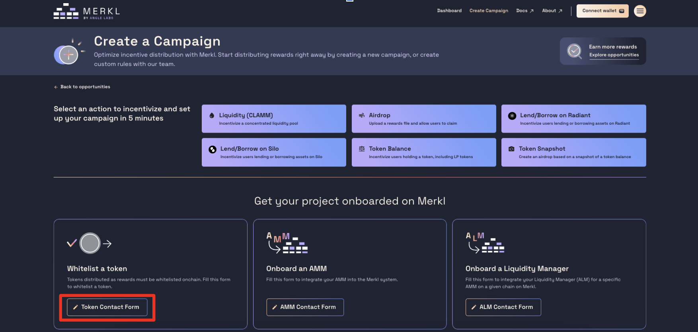

# Airdrop Campaign

Merkl makes airdropping tokens to your community simple and efficient!

**Important Note:** Merkl applies a fee of 0.5%. Therefore, if the total amount of tokens to be airdropped in your JSON file sums up to 100,000, then 100,000 will be distributed to the recipients and a fee will be applied on top of it. To ensure that 100,000 tokens reach your users, you need to provide 100,502.512563 tokens (100,000 / (1 - 0.5%)).

**Step-by-Step Process:**

1. **Access the Campaign Creation Page**

* Go to the Merkl App and navigate to the campaign creation section by selecting *Create Campaign* from the dashboard.

<figure><figcaption></figcaption></figure>

2. **Whitelist your Token**

* After clicking on the *Create Campaign*, this will redirect you to the page below. But first we need to whitelist your token (if it has not been whitelisted already). Fill up the following [form](https://tally.so/r/3y2bqx) - you can also access by clicking where the red square is (see screenshot) on the Merkl App.

<figure><figcaption></figcaption></figure>

3. **Connect your Wallet**

* Connect your wallet and select the chain on which you want to airdrop your token. **The chain connected to your wallet during the airdrop campaign creation will determine where the rewards are distributed.** To see all the chains that Merkl supports, check this [page](https://app.merkl.xyz/integrations).

4. **Create your Airdrop Campaign**

* Once your token is whitelisted, you can start your airdrop campaign by clicking on the *Airdrop* button (see screenshot below).

<figure><figcaption></figcaption></figure>

5. **Upload your JSON file**

* After clicking on the *Airdrop* button, you will be redirected to the next page (see screenshot below) where you will need to upload your JSON file. **Your JSON file must adhere to the same format as the provided template**. Below, you will find the template and an example.

<figure><figcaption></figcaption></figure>

**JSON format**

Your JSON file must have the following format:

```
type AirdropJSON = {
    // Token being distributed
    rewardToken: string;
    // User rewards
    rewards: {
        // recipient: user address
        [recipient: string]: {
            // Reason: how the user got the rewards
            [reason: string]: string; // value: amount with all decimals as a string
        };
    };
};
```

**JSON example**

```
{
  "rewardToken": "0x1a7e4e63778B4f12a199C062f3eFdD288afCBce8",
  "rewards": {
    "0x529619a10129396a2F642cae32099C1eA7FA2834": {
      "reason1": "1827034243855622331"
    },
    "0x0C2553e4B9dFA9f83b1A6D3EAB96c4bAaB42d430": {
      "reason1": "1827034243855622331",
      "reason2": "1035298980258165611"
    }
  }
}
```

* **rewardToken:** The token being distributed.
* **rewards:** User rewards with recipient addresses and reasons for the rewards.

6. **Preview Transaction**

* Double-check all the information entered for accuracy. Once you have finished configuring your campaign, proceed by pressing the *Preview Transaction* button.

<figure><figcaption></figcaption></figure>

7. **Sign and Submit**

You can sign and submit using either an EOA account or a multisig wallet. The recommended method for distributing rewards with Merkl using a multisig is through the Gnosis Safe Transaction Builder. Regardless of the method you choose, you will need to follow these steps: sign the T\&C conditions, approve the tokens for transfer, and deposit them.

* **Using an EOA Account:**
  * Double-check your campaign configuration.
  * Read and accept Merkl's T\&Cs by clicking on the *Accept* button and signing using your wallet.
  * Approve the tokens for transfer and deposit the amount you want to airdrop, keeping in mind that Merkl will collect 0.5% of the tokens as a maintenance fee.

<figure><figcaption></figcaption></figure>

After these steps, congratulations! You have created your Airdrop Campaign using Merkl!


Please note that once created, your campaign may take up to one hour to become visible on the front-end.


* **Using a multisig wallet (Safe Wallet):**

The recommended method for distributing rewards with Merkl using a multisig is through the Gnosis Safe Transaction Builder.

To learn how to deploy your campaign from a multisig or Gnosis Safe Transaction Builder, check this [page](../deploy-your-campaign-from-a-multisig-or-gnosis-safe.md) where everything is explained in more detail.


[deploy-your-campaign-from-a-multisig-or-gnosis-safe.md](../deploy-your-campaign-from-a-multisig-or-gnosis-safe.md)



Please note that once created, your campaign may take up to one hour to become visible on the front-end.

