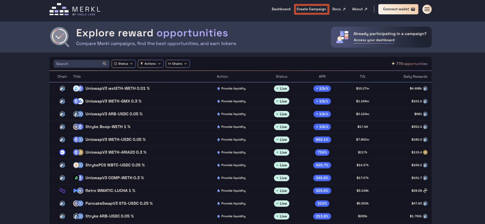
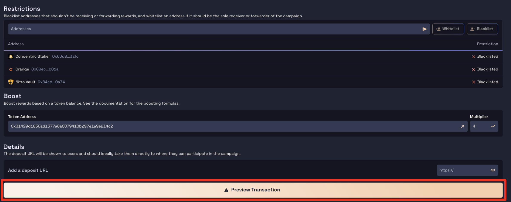

# Concentrated Liquidity Pool Incentivization Campaign

On this page, you will first find an explanation of the available parameters for customizing your campaign and Merkl's key features, followed by a step-by-step guide to help you set up your campaign effectively.

## Why So Many Parameters?

You might be wondering why there are so many parameters for setting up a concentrated liquidity campaign on Merkl. The reason is simple: we want to empower you to incentivize the exact behavior you desire. This flexibility is at the core of Merkl—enabling anyone to incentivize the on-chain behavior they want!

## Understanding the Merkl Engine

Before starting your campaign, it's important to understand how the Merkl engine works. The engine calculates and distributes rewards based on the parameters you set for incentivizing liquidity providers.

The Merkl engine runs at different frequencies depending on the chain, typically every 4 to 12 hours (with an average of 8 hours). You can check the status for each chain in our app [here](https://app.merkl.xyz/status).

For example, if you create a 14-day campaign with a budget of $42,000, and the engine runs every 8 hours (3 times per day), there will be a total of 42 runs (14 days × 3 runs per day). As a result, the rewards per run would be $1,000 ($42,000 ÷ 42), i.e farmers will be able to claim $1,000 from the rewards you allocated at each engine run. 

## In-Range vs Out-of-Range Liquidity

The first choice is simple: do you want to incentivize in-range or out-of-range liquidity?

We **highly recommend incentivizing in-range liquidity**, as this ensures that only liquidity providers actively providing liquidity will receive rewards. While we don't see much value in incentivizing out-of-range liquidity, it’s available if it suits your needs.

## The 3 Merkl’s Parameters to Help you Shape Your Strategy

Merkl allows you to allocate rewards based on three parameters:

1. **Fees**
2. **Token0** (e.g., for the pool USDA - ARB, USDA is token0)
3. **Token1** (e.g., for the pool USDA - ARB, ARB is token1)

Each parameter represents a percentage of the total rewards, so choose carefully based on what you want to incentivize

### Parameters details

For each parameter, you need to assign a percentage of the total rewards:

- **Fees**: Represents the percentage of rewards allocated based on fees earned.
    - Example: If you set `fees = 40%`, all rewards will be distributed based on the fees earned by users. For example, if a user earns 50% of the total fees from an epoch, they will receive 20% of the total rewards for that epoch.
- **Token0**: Represents the percentage of rewards based on a user's share of the total supply of Token0 in the pool.
    - Example: If you set `Token0= 30%` and a user holds 30% of the Token0 in the pool for an entire epoch, they will receive 9% (30% × 30%) of the total rewards for that epoch.
- **Token1**: Represents the percentage of rewards based on a user's share of the total supply of Token1 in the pool.
    - Example: If you set `Token1= 50%` and a user holds 20% of the Token1 in the pool for the entire epoch, they will receive 10% (50% × 20%) of the total rewards for that epoch.

These parameters help you fine-tune how rewards are allocated to align with your campaign goals.

### Distribution Formula

The exact formula used for reward distribution for a position in a pool during a specified time period is as follows:

$$
\left[ \frac{w_f \times \text{fees by position}}{\text{fees by pool}} + \frac{w_A \times A_{\text{in position}}}{A_{\text{in pool}}} + \frac{w_B \times B_{\text{in position}}}{B_{\text{in pool}}} \right] \times \text{optional gov token boost}
$$

### Explanation of the Formula

- **w_fees:** Weight assigned to rewards based on fees earned.
- **w_A:** Weight assigned to rewards for Token0 in the pool.
- **w_B:** Weight assigned to rewards for Token1 in the pool.
- **Fees by position / Fees by pool**: The share of total fees earned by the user’s position compared to the total fees generated by the pool during an epoch.
- **A in position / A in pool**: The user’s share of Token0 in the pool, calculated as the amount of Token0 in the user’s position divided by the total Token0 in the pool during an epoch.
- **B in position / B in pool**: The user’s share of Token1 in the pool, calculated as the amount of Token1 in the user’s position divided by the total Token1 in the pool during an epoch.
- **Optional gov token boost**: A multiplier based on token holdings that can boost rewards, if applicable.

As you can see, the weights you assign when selecting your parameters are crucial to determining the distribution of rewards and achieving your incentivization goals.

## Applying boost

Merkl allows you to boost user rewards based on token holdings on a chain. This feature is optional and provides extra incentives to users who hold specific tokens. To learn more about the boost formula, please refer to this [page from our docs](https://docs.merkl.xyz/distribute-with-merkl/boosting-rewards-with-merkl).

If you do not wish to apply a boost based on token holdings, simply leave this section blank.

## Incentivized bridged liquidity

Merkl has partnered with Jumper to enable incentivized bridged liquidity. This feature allows chains to incentivize users to bridge liquidity from another chain, rather than moving it between protocols on the same chain. This results in a real chain-wide increase in liquidity.

If you do not wish to use the incentivized bridged liquidity feature, you can leave this section blank.

Creating a Concentrated Liquidity (CLAMM) Pool Incentive campaign on Merkl is a straightforward process. Follow these steps to set up and launch your campaign effectively:

## Step-by-Step Process:

1. **Access the Campaign Creation Page**
   * Go to the Merkl's App and go to the campaign creation section by selecting *Create Campaign* from the dashboard.

<figure><figcaption></figcaption></figure>

2. **Whitelist your Token**

* After clicking on the *Create Campaign*, this will redirect you to the page below. But first we need to whitelist your token. Fill up the following [form](https://tally.so/r/3y2bqx) - you can also access by clicking where the red square is (see screenshot) on the Merkl App.

<figure><figcaption></figcaption></figure>

3. **Connect you Wallet**

* Connect your wallet and select the chain on which you want to distribute the rewards. **The chain connected to your wallet during the campaign creation will determine where the rewards are distributed.** To see all the chains that Merkl supports, check this [page](https://app.merkl.xyz/integrations). **One of the core features of Merkl is the ability to incentivize activity on one chain while distributing rewards on another.**

4. **Create your CLAMM Campaign**

* Once your token is whitelisted, you can create your CLAMM campaign by clicking on the appropriate button (see screenshot below).

<figure><figcaption></figcaption></figure>

5. **Fill Out Campaign Details**

<figure><figcaption></figcaption></figure>

* You will then be redirected to the campaign configuration page, where you will need to provide the following details:

**Distribution Details:**

* **Total Rewards:** Enter the total amount of rewards to be distributed. Keep in mind that a 3% maintenance fee is applied.
* **Duration:** Set the start and end dates for the campaign.
* **Min Rewards/Hour:** Ensure your distribution per hour is above the minimum rewards per hour. The Min Rewards/Hour is set at $1 per hour.

**Liquidity Pool Selection:**

* **Chain:** Choose the blockchain network (Ethereum, Arbitrum, Optimism, etc.) where the campaign will be conducted. Note that the chain on which the campaign runs can be different from the chain on which you reward users.
* **Pool:** Select the liquidity pool to incentivize from the dropdown menu or enter the pool address manually.
* **Reward allocation:**
  * **Token0:** Specify the percentage of rewards allocated to holding Token0.
  * **Token1:** Specify the percentage of rewards allocated to holding Token1.
  * **Fees:** Specify the percentage of rewards allocated to Fees.
  * **Incentivize only in-range or in-and-out-range liquidity positions:** Choose the applicable option.

**Rewards Forwarders:**

* Enable the Automated Liquidity Managers (ALM) that will forward your campaign rewards to the Liquidity Providers using an ALM, and disable the ALMs you don't want to send rewards to.

<figure><figcaption></figcaption></figure>

<figure><figcaption></figcaption></figure>

* As fewer ALMs are enabled, the restriction changes from blacklisted (disabled addresses) to whitelisted (enabled addresses).

<figure><figcaption></figcaption></figure>

**Further Restrictions:**

* If you want to whitelist or blacklist EOAs (Externally Owned Accounts), you can do so manually by adding them.

**Boost:**

* Boost rewards based on a token balance by providing the address of the token you want to incentivize and specifying the boost multiplier. This allows you to incentivize users to hold a specific token in their wallet to earn additional rewards.

<figure><figcaption></figcaption></figure>

**Details:**

* **Deposit URL:** Provide the deposit URL where users can participate in the campaign. This URL should direct them to the relevant page for participating in the campaign.

6. **Preview Transaction and Submit**

* Double-check all the information entered for accuracy. Once you have finished configuring your campaign, proceed by pressing the *Preview Transaction* button.

<figure><figcaption></figcaption></figure>

7. **Sign and Submit**

You can sign and submit using either an EOA account or a multisig wallet. The recommended method for distributing rewards with Merkl using a multisig is through the Gnosis Safe Transaction Builder. Regardless of the method you choose, you will need to follow these steps: sign the T\&C conditions, approve the tokens for transfer, and deposit them.

* **Using an EOA Account:**
  * Double-check your campaign configuration.
  * Read and accept Merkl's T\&Cs by clicking on the *Accept* button and signing using your wallet.
  *   Approve the tokens for transfer and deposit the amount you want to incentivize, plus the maintenance fee of 3%.

<figure><figcaption></figcaption></figure>

After these steps, congratulations! You have created your Concentrated Liquidity Merkl Incentivization Campaign!


Please note that once created, your campaign may take up to one hour to become visible on the front-end.


* **Using a multisig wallet (Safe Wallet):**

The recommended method for distributing rewards with Merkl using a multisig is through the Gnosis Safe Transaction Builder.

To learn how to deploy your campaign from a multisig or Gnosis Safe Transaction Builder, check this [page](../deploy-your-campaign-from-a-multisig-or-gnosis-safe.md) where everything is explained in more detail.


[deploy-your-campaign-from-a-multisig-or-gnosis-safe.md](../deploy-your-campaign-from-a-multisig-or-gnosis-safe.md)



Please note that once created, your campaign may take up to one hour to become visible on the front-end.

