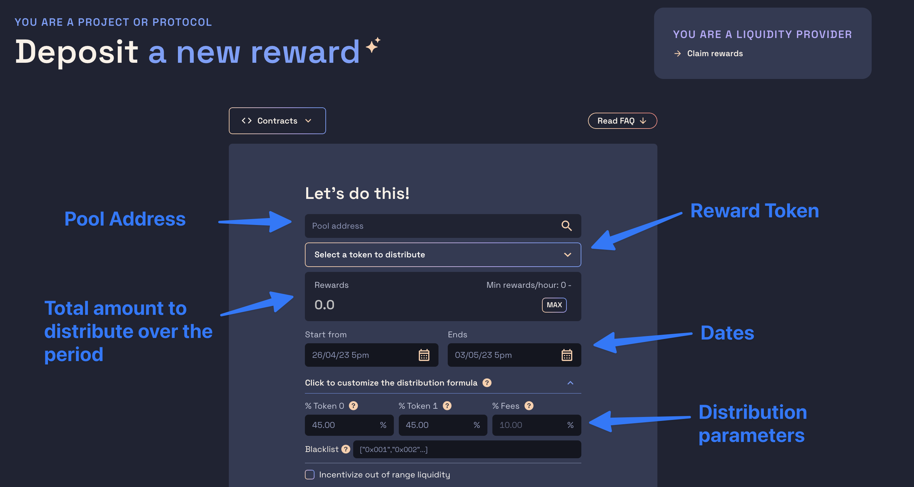
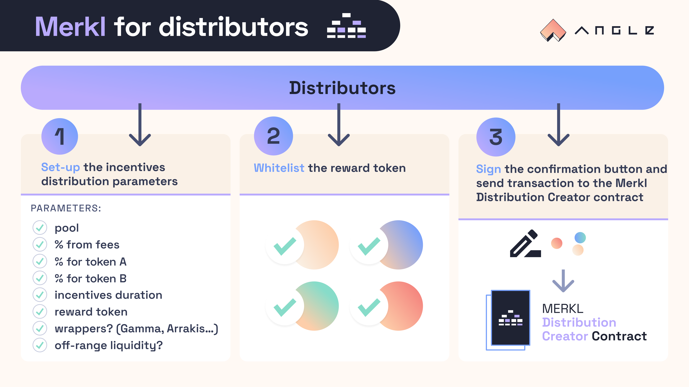

# Incentivize concentrated liquidity pools with Merkl

Everything you need to know to make the most of your incentives on concentrated liquidity pools!

## Campaign configuration

The following parameters are specific to concentrated liquidity campaigns, you can find the parameters common to all campaigns [here](../README.md#configure-your-campaign)

### Required Parameters

- Pool Address: address of the pool you want to incentivize
- % Fees: % of incentives allocated by only looking at the fees accrued by the LPs
- % Token0: % of incentives allocated by only looking at the amount of token0 provided by the LPs
- % Token1: % of incentives allocated by only looking at the amount of token1 provided by the LPs

### Optional Parameters

- Incentivize out of range liquidity: defaults to false, wether or not to consider LPs positions which don't have liquidity on the tick of the pool during reward calculation
- Boost token address: defaults to null address (disabled), address of the token which needs to be held by LPs to apply a boost to their rewards
- Boost: defaults to 0 (no boost), multiplier to apply to holders of the boost token, should be set to a value greater than 1

### Use cases

No matter the campaign configuration, creating a Merkl campaign will always increase the pool TVL as it will attract more LPs.

However, **the key feature of Merkl is its ability to shape the liquidity of the pool**.

#### Increase pool volume by decreasing slippage

**Goal:** increase the liquidity at the pool swap tick (low slippage)

**Key configuration parameters**:

- % Fees: 100
- % Token0: 0
- % Token1: 0
- Incentivize out of range liquidity: false

If your pool has a low volume (less than 10 swaps per hour) on a chain with low gas fees:

- Whitelist: Addresses of one or several active liquidity management (ALM) vaults integrated in Merkl

Whitelisting vaults forces LPs to provide liquidity through an ALM, we recommend this approach to avoid having farmers provide very concentrated liquidity around the tick, executing a swap and removing their liquidity right after the swap. When only incentivizing fees, Merkl only looks at how the fees were distributed to the LPs when calculating the rewards, this means that if a user provided a small amount of liquidity in a very tight range and executed a swap in that range right after, that user will collect most of the fees of that swap. If the pool volume is low, this means that a user could potentially accrue all the rewards for a campaign by executing this type of transactions. Forcing users to use ALMs will negate this issue as ALMs do not create such positions.

#### Create directional low slippage for a given token of the pool (e.g a governance token)

**Goal:** Encouraging swaps for a given token of the pool and discouraging swaps in the other direction

This approach is useful for newly created governance tokens. You want people to be able to easily buy (low slippage when swapping to your governance token) your token but you want to avoid them dumping it (high slippage when swapping from your governance token).

**Key configuration parameters for low slippage on token0**:

- % Fees: 20
- % Token0: 80
- % Token1: 0
- Incentivize out of range liquidity: false

This configuration will force LPs to provide asymmetric liquidity to your pool and will have a double effect:

- LPs will need to provide a lot of token0 when creating positions (if token0 is in a position then it's not being dumped!)
- Swappers will have a very good price when buying your token and have a very bad price because of slippage when dumping your token.

You could put all the incentives on token0 but having some on fees will encourage LPs to have tighter positions, further decreasing slippage.

## 💰 Create an incentivization campaign with Merkl (legacy)

DAOs or individuals looking to incentivize Liquidity Providers can use Merkl to create custom and efficient campaigns and get better liquidity.

Incentivization Campaigns can be setup on [this app](https://merkl.xyz) or directly from the [`DistributionCreator` contract](../../addresses.md) on the chain of your choice [with a script](#with-a-custom-script) or [from a Gnosis Safe multisig](#from-a-multisig-or-a-gnosis-safe).

Regardless of the method you are using, before depositing any incentives, make sure that:

- You have read and agreed to the T&Cs. The `DistributionCreator` contract will require you to sign this T&Cs and post your signature onchain. This is a one time requirement that you'll only need to do once when creating your first distribution.
- The token you want to distribute has been whitelisted and the amount per hour of tokens you want to distribute is greater than the minimum amount allowed in the contract (more on this below)
- The AMM you're looking to send incentives to is supported on the chain you want to use


[incentivizor-tc.md](../incentivizor-tc.md)



Once created, a campaign on Merkl may take up to 1 hour to be picked up by the Merkl API and front interface. You may track how rewards were distributed to LPs of the pool by checking this [website](https://rewards.merkl.xyz/) which contains the history of rewards given across all distributions across all pools of all supported AMMs.



If you want Merkl to integrate a new chain, a new AMM, or a new liquidity manager, check [this page](https://merkl.xyz/partner)


### 📱 On [merkl.xyz](https://merkl.xyz)

You just need to fill the `address` of the pool you want to incentivize, the `total amount` of tokens you want to distribute, and the beginning and end dates of the distribution.




Reward tokens need to be whitelisted before being used, and for whitelisted tokens, there is a minimum amount that needs to be sent for campaigns to be considered valid. If the reward token you want to use has not been whitelisted, please [fill out this form](https://tally.so/r/3y2bqx).


If some smart contract addresses need to be excluded from the campaign because they can't claim rewards, make sure to specify their addresses in the `Blacklist`.

Merkl natively and automatically supports different liquidity position managers. LPs can provide liquidity there while being rewarded on Merkl. Note though that supported liquidity position managers (like Gamma or Arrakis) are not available for all pools, so you may want to check which of the supported liquidity position managers are available for your pool.

Then, you can customize any of the campaign formula parameters. When this is done, the app will prompt you to sign the T&Cs message (if it has not already been done), and then to post the transaction sending the tokens to the distribution contract!

Any address holding a position or a position manager token will be able to claim their rewards at the end of each epoch according to how they provided liquidity on the pool.


Merkl App does not integrate well with smart contract wallets when it comes to providing signatures, so if you're using a smart contract wallet, please refer to the section below. If your address has been whitelisted, check out the guide for Gnosis Safe multisig [here below](#if-your-multisig-has-been-whitelisted).




### From a multisig or a Gnosis Safe

The recommended method of interaction to distribute rewards with Merkl with a multisig is to use Gnosis Safe Transaction Builder.

#### Building the payload

Now that the signing requirement is clear, what payload should you set in the Gnosis Safe transaction builder?

Below is an example payload with two transactions:

- an approval of the reward token to the Merkl `DistributionCreator` contract
- the transaction to create the distributions with chosen parameters


Merkl Multisig Payload from Gnosis Transaction Builder


The `distribution` tuple given for the `createDistribution` function has the following form:

```json
[
  // Distribution ID: this value must be left as is and cannot be customized
  "0x0000000000000000000000000000000000000000000000000000000000000000",
  // Address of the pool to incentivize
  "0xf44aCAa38be5E965c5Ddf374E7a2BA270e580684",
  // Address of the reward token (here the OP token)
  "0x4200000000000000000000000000000000000042",
  // Total amount of tokens to distribute
  "2000000000000000000000",
  // If any, addresses to blacklist from the distribution
  [],
  // If there are addresses to blacklist, this array should be an array with only 3 in it and of
  // the same length as the array above
  [],
  // Proportion of rewards that'll be split among LPs which brought token0 in the pool during
  // the time of the distribution
  3000,
  // Proportion of rewards that'll be split among LPs which brought token1 in the pool during
  // the time of the distribution
  6000,
  // Proportion of rewards that'll be split among LPs which accumulated fees during the time
  // of the distribution
  1000,
  // Timestamp of the start of the distribution
  1689811200,
  // Number of hours for which the distribution will last once it has started
  168,
  // Whether out of range liquidity should be incentivized
  0,
  // Multiplier provided by the address boosting reward. In the case of a Curve distribution where veCRV
  // provides a 2.5x boost, this would be equal to 25000
  0,
  // Address of the token which dictates who gets boosted rewards or not. This is optional
  // and if the zero address is given no boost will be taken into account
  "0x0000000000000000000000000000000000000000",
  // Additional data to specify for the distribution. This value must be left as is and cannot be customized
  "0x"
]
```

After using the payload provided in example and customizing both the approval and the parameters of the `createDistribution` transaction to fit your needs, you should be ready to execute the transaction to distribute rewards to Merkl!

#### If your multisig has been whitelisted

It's possible that addresses are whitelisted so they do not need to post a signature onchain to be able to distribute rewards.
If your multisig address has been whitelisted by Angle Labs, then you can directly interact with Merkl front from your Gnosis Safe.

To do this, head to the Apps section of your multisig, select `My Custom Apps` and then click on `Add custom Safe App`, at which point you can enter for the `Safe App URL` the [Merkl app URL](https://merkl.xyz/).


Usually, Angle Labs will proceed to whitelisting a multisig if one of the signers of the multisig has posted a signature of the T&Cs onchain on the Merkl contract.


### With a custom script

You do not specifically need to use the Angle frontend interface to reward pools on Merkl: this can directly be done with a transaction at the smart contract level.

The following script shows how to create one or multiple distributions at once on Merkl.

```typescript
import {
  DistributionCreator__factory,
  Erc20__factory,
} from '@angleprotocol/public-sdk'
import { parseEther } from 'ethers/lib/utils'
import { ethers, web3 } from 'hardhat'

async function main() {
  const [deployer] = await ethers.getSigners()
  const ZERO_ADDRESS = ethers.constants.AddressZero
  const MAX_UINT256 = ethers.constants.MaxUint256

  // Address of the reward token to send
  const rewardTokenAddress = '0x84FB94595f9Aef81147cD4070a1564128A84bb7c'
  // Address of the pool
  const pool = '0x3fa147d6309abeb5c1316f7d8a7d8bd023e0cd80'

  // Same address across all chains
  const distributionCreatorAddress =
    '0x8BB4C975Ff3c250e0ceEA271728547f3802B36Fd'

  const distributionCreator = DistributionCreator__factory.connect(
    distributionCreatorAddress,
    deployer,
  )
  const rewardToken = Erc20__factory.connect(rewardTokenAddress, deployer)

  const params = {
    // Address of the pool to incentivize
    uniV3Pool: pool,
    // Address of the reward token (must be whitelisted)
    rewardToken: rewardTokenAddress,
    // Addresses to exclude from the distribution (or optionally addresses of the wrappers that are not automatically detected
    // by the script)
    positionWrappers: ['0xa29193Af0816D43cF44A3745755BF5f5e2f4F170'],
    // Type of the wrappers (3=blacklisted addresses, 0=whitelisted addresses)
    wrapperTypes: [3],
    // Amount of tokens to send for the WHOLE distribution. The amount distributed per hour is `amount/numEpoch`
    amount: parseEther('350'),
    // Proportion of rewards that'll be split among LPs which brought token0 in the pool during the time
    // of the distribution
    propToken0: 4000,
    // Proportion of rewards that'll be split among LPs which brought token1 in the pool during the time
    // of the distribution
    propToken1: 2000,
    // Proportion of rewards that'll be split among LPs which accumulated fees during the time
    // of the distribution
    propFees: 4000,
    // Whether out of range liquidity should be incentivized
    isOutOfRangeIncentivized: 0,
    // Timestamp of the start of the distribution (in block.timestamp units)
    epochStart: 1676649600,
    // Number of hours for which the distribution will last once it has started
    numEpoch: 500,
    // Multiplier provided by the address boosting reward. In the case of a Curve distribution where veCRV
    // provides a 2.5x boost, this would be equal to 25000
    boostedReward: 0,
    // Address of the token which dictates who gets boosted rewards or not. This is optional
    // and if the zero address is given no boost will be taken into account. In the case of Curve, this address
    // would for instance be the veBoostProxy address, or in other cases the veToken address.
    boostingAddress: ZERO_ADDRESS,
    // These two parameters are useless when creating a distribution, you may specify here whatever you like
    rewardId: web3.utils.soliditySha3('europtimism') as string,
    additionalData: web3.utils.soliditySha3('europtimism') as string,
  }

  // Comment if you've already approved the contract with `rewardToken`
  console.log('Approving')
  await (
    await rewardToken
      .connect(deployer)
      .approve(distributionCreator.address, MAX_UINT256)
  ).wait()

  /*
  Before depositing a reward, you must make sure that:
  1. Your reward token is whitelisted for the reward distribution and that the per hour distribution amount
  will be higher than the limit
  2. You have read the T&C before signing them
  */

  console.log('Signing the T&C')
  const message = await distributionCreator.message()
  console.log(message)
  const signature = await deployer.signMessage(message)

  console.log('Depositing reward...')
  await (
    await distributionCreator
      .connect(deployer)
      .signAndCreateDistribution(params, signature)
  ).wait()
  console.log('...Deposited reward ✅')

  // Now if you want to create multiple distributions at once, you may also do it as well

  const params1 = {
    uniV3Pool: pool,
    rewardToken: rewardTokenAddress,
    positionWrappers: ['0xa29193Af0816D43cF44A3745755BF5f5e2f4F170'],
    wrapperTypes: [2],
    amount: parseEther('500'),
    propToken0: 4000,
    propToken1: 2000,
    propFees: 4000,
    isOutOfRangeIncentivized: 0,
    epochStart: 1680269613,
    numEpoch: 500,
    boostedReward: 0,
    boostingAddress: ZERO_ADDRESS,
    rewardId: '0x',
    additionalData: '0x',
  }

  const params2 = {
    uniV3Pool: pool,
    rewardToken: rewardTokenAddress,
    positionWrappers: ['0xa29193Af0816D43cF44A3745755BF5f5e2f4F170'],
    wrapperTypes: [2],
    amount: parseEther('750'),
    propToken0: 4000,
    propToken1: 2000,
    propFees: 4000,
    isOutOfRangeIncentivized: 0,
    epochStart: 1681565613,
    numEpoch: 500,
    boostedReward: 0,
    boostingAddress: ZERO_ADDRESS,
    rewardId: '0x',
    additionalData: '0x',
  }

  console.log('Depositing multiple rewards at once...')
  await (
    await distributionCreator
      .connect(deployer)
      .createDistributions([params1, params2])
  ).wait()
  console.log('...Deposited rewards ✅')
}

main().catch((error) => {
  console.error(error)
  process.exit(1)
})
```
