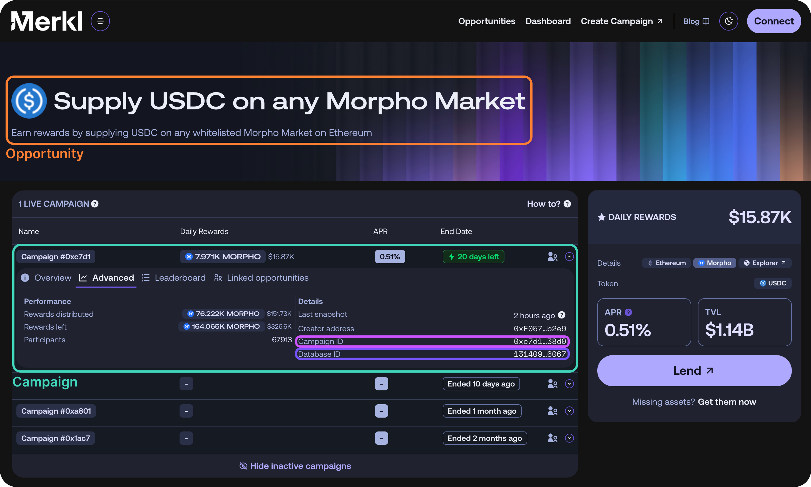

# Integrate Merkl API

Merkl provides an API, available [here](https://api.merkl.xyz/docs), that serves all the data shown in the Merkl app. You can use it to track campaigns, display APRs, and integrate user rewards directly into your frontend as a white-label solution.

This guide will walk you through the key integration patterns and best practices for using the Merkl API. We encourage you to reference the full API documentation for detailed endpoint specifications.


If you use Merkl as a white-label solution in your frontend, you must integrate [our logo](branding-and-integration.md) with a clickable link that redirects to our app.



The Merkl API provides two types of data for displaying incentive information: **campaigns** and **opportunities**. Before integrating the API, it's important to understand [the difference between a campaign and an opportunity](../merkl-mechanisms/technical-overview.md#opportunity-vs-campaign) within Merkl.


## Finding Relevant Opportunities

The opportunities endpoint provides key metrics like APR, TVL, and daily rewards that you can display in your frontend.

Multiple filters are available to query opportunities. For a complete list, see the [opportunities endpoint documentation](https://api.merkl.xyz/docs#tag/opportunities/GET/v4/opportunities/).

**Recommended filters:**

**By Protocol ID** - Find all opportunities for a specific protocol:

```
https://api.merkl.xyz/v4/opportunities?mainProtocolId={protocol_id}
```

Example for Euler: [`https://api.merkl.xyz/v4/opportunities?mainProtocolId=euler`](https://api.merkl.xyz/v4/opportunities?mainProtocolId=euler)

To find your protocol's ID, check existing opportunities on the API or try filtering by name first (`https://api.merkl.xyz/v4/opportunities?name={name}`)

**By Explorer Address** - Find opportunities for a specific pool or lending market:

```
https://api.merkl.xyz/v4/opportunities?explorerAddress={address}
```

Example for the Aave USDT0 market on Plasma: [`https://api.merkl.xyz/v4/opportunities?explorerAddress=0x5D72a9d9A9510Cd8cBdBA12aC62593A58930a948`](https://api.merkl.xyz/v4/opportunities?explorerAddress=0x5D72a9d9A9510Cd8cBdBA12aC62593A58930a948)

**By Chain ID** - Find all opportunities on a specific chain:

```
https://api.merkl.xyz/v4/opportunities?chainId={chain_id}
```

Example for Ethereum: [`https://api.merkl.xyz/v4/opportunities?chainId=1`](https://api.merkl.xyz/v4/opportunities?chainId=1)

**By Tags** - Find opportunities across multiple protocols and chains:

```
https://api.merkl.xyz/v4/opportunities?tags={tag}
```

Example for zkSync Ignite Program: [`https://api.merkl.xyz/v4/opportunities?tags=zksync`](https://api.merkl.xyz/v4/opportunities?tags=zksync)

If you need a custom tag for your opportunities, contact us and we'll assign it to your campaigns.


Each opportunity has a permanent unique ID that remains unchanged even when multiple successive campaigns are created on the same pool or asset.


## Finding Relevant Campaigns

While the opportunities endpoint provides high-level metrics about what's being incentivized, the campaigns endpoint offers detailed campaign rules (duration, budget, campaign type, customization options, etc.). Use this endpoint to display in-depth campaign information to your users.

For a complete list of available filters, see the [campaigns endpoint documentation](https://api.merkl.xyz/docs#tag/campaigns/GET/v4/campaigns/).

**Recommended filters:**

**By Creator Address** - Find all campaigns created by a specific address:

```
https://api.merkl.xyz/v4/campaigns?creatorAddress={address}
```

Example: [`https://api.merkl.xyz/v4/campaigns?creatorAddress=0xdef1FA4CEfe67365ba046a7C630D6B885298E210`](https://api.merkl.xyz/v4/campaigns?creatorAddress=0xdef1FA4CEfe67365ba046a7C630D6B885298E210)

**By Token Symbol** - Find all campaigns distributing a specific reward token:

```
https://api.merkl.xyz/v4/campaigns?tokenSymbol={symbol}
```

Example for campaigns distributing $PYTH: [`https://api.merkl.xyz/v4/campaigns?tokenSymbol=PYTH`](https://api.merkl.xyz/v4/campaigns?tokenSymbol=PYTH)

## Retrieving Both Campaign and Opportunity Data

The `campaigns` endpoint provides campaign-specific information but not upstream opportunity data. Similarly, querying for an opportunity doesn't include downstream campaign details. To retrieve all information in a single request:

**Search campaigns with related opportunities** - Use `/v4/campaigns` with `withOpportunity=true`:

```
https://api.merkl.xyz/v4/campaigns?withOpportunity=true
```

**Search opportunities with related campaigns** - Use `/v4/opportunities` with `campaigns=true`:

```
https://api.merkl.xyz/v4/opportunities?campaigns=true
```


When multiple campaigns run in parallel on the same opportunity with different rules (e.g., different blacklists), their eligible TVL values may differ. When querying an opportunity, the TVL shown is the maximum eligible TVL across all underlying campaigns, and the APR is the sum of all campaign APRs.


### About Campaign IDs

Merkl uses two distinct identifier types for campaigns:

* **`campaignId`** (format: `0x...`): The onchain identifier of a campaign. Note that this is **not unique** across chains—multiple campaigns on different chains may share the same `campaignId`. You can find this in the [opportunities page](https://app.merkl.xyz/) by selecting an opportunity, viewing campaign details, and navigating to the "Advanced" tab.
* **`id`** (format: numeric, e.g., `13972358188887408622`): The unique database identifier used for most API routes. You can retrieve this by querying the [campaigns endpoint](https://api.merkl.xyz/docs#tag/campaigns/get/v4/campaigns/) with a `campaignId`. You may also find a campaign's database ID under the advanced tab of a campaign on the Merkl app.

<figure><figcaption></figcaption></figure>

## Fetching Campaign and User Statistics

The Merkl API provides endpoints to retrieve user leaderboards and reward statistics for individual campaigns or across multiple campaigns distributing the same token.

**Recommended endpoints:**

* **Campaign leaderboard**: Get all users rewarded in a campaign - [`https://api.merkl.xyz/docs#tag/rewards/get/v4/rewards/`](https://api.merkl.xyz/docs#tag/rewards/get/v4/rewards/)
* **Token-level rewards**: Check rewards across all campaigns for a token - [`https://api.merkl.xyz/docs#tag/rewards/get/v4/rewards/token/`](https://api.merkl.xyz/docs#tag/rewards/get/v4/rewards/token/)
* **Campaign-level rewards**: Check total amount of rewards distributed in a specific campaign - [`https://api.merkl.xyz/docs#tag/rewards/get/v4/rewards/total`](https://api.merkl.xyz/docs#tag/rewards/get/v4/rewards/total)
* **Unclaimed rewards**: Check unclaimed amounts for a campaign - [`https://api.merkl.xyz/docs#tag/rewards/get/v4/rewards/unclaim/`](https://api.merkl.xyz/docs#tag/rewards/get/v4/rewards/unclaim/)
* **Historical metrics**: Get TVL and APR history for a campaign - [`https://api.merkl.xyz/docs#tag/campaigns/get/v4/campaigns/{id}/metrics`](https://api.merkl.xyz/docs#tag/campaigns/get/v4/campaigns/{id}/metrics)

## Integrating User Rewards

To retrieve reward data for a specific user, use the following endpoint:

```
https://api.merkl.xyz/v4/users/{address}/rewards?chainId={chain_id}
```

Example - Checking a user's rewards on zkSync: [`https://api.merkl.xyz/v4/users/0x4F2BF7469Bc38d1aE779b1F4affC588f35E60973/rewards?chainId=324`](https://api.merkl.xyz/v4/users/0x4F2BF7469Bc38d1aE779b1F4affC588f35E60973/rewards?chainId=324)

**This endpoint returns:**

* **`amount`**: Total tokens credited to the user onchain
* **`pending`**: Pending rewards that will be credited on the next Merkle root update
* **`claimed`**: Tokens already claimed by the user
* **`proofs`**: Cryptographic proofs needed for claiming rewards (detailed in the next section)
* **`breakdowns`**: Campaign attribution for earned rewards (may be incomplete and not show all campaigns)


The claimable amount equals `amount - claimed`.


**Important notes about this endpoint:**

* **Historical data**: The API doesn't return time-series data. To build historical datasets, take daily snapshots of the API responses.
*   **Caching behavior**: This route is cached. If called immediately after a user claims rewards, the data may be stale. Use the `reloadChainId` parameter to force a cache refresh:

    ```
    https://api.merkl.xyz/v4/users/{address}/rewards?chainId=324&reloadChainId=324
    ```

**Building claim transactions:**

Rewards are claimed through the `Distributor` contract. Find contract addresses for each chain on the [Merkl status page](https://app.merkl.xyz/status).


If the `token` or `amount` doesn't match the `proof` when calling the `Distributor` contract, the transaction will revert.


Rewards on Merkl are claimable per token. Users can claim rewards for a single token or all tokens at once.

**Example claiming script:**

Here is a script to claim all token rewards for a user on a chain:

```javascript
import type { JsonRpcSigner } from '@ethersproject/providers'
import { MerklApi } from '@merkl/api'
import { Distributor__factory } from '@sdk' // ABI can be fetched on etherscan

const DISTRIBUTOR_ADDRESS = '0x3Ef3D8bA38EBe18DB133cEc108f4D14CE00Dd9Ae'

export const claim = async (chainId: number, signer: JsonRpcSigner) => {
  const { status, data } = await MerklApi('https://api.merkl.xyz')
    .v4.users({ address: signer._address })
    .rewards.get({ query: { chainId: [chainId] } })
  if (status !== 200) throw 'Failed to fetch rewards'

  const users = []
  const tokens = []
  const amounts = []
  const proofs = []

  for (const rewards of data) {
    if (rewards.chain.id !== chainId) continue
    for (const reward of rewards.rewards) {
      users.push(signer._address)
      tokens.push(reward.token.address)
      amounts.push(reward.amount)
      proofs.push(reward.proofs)
    }
  }

  if (tokens.length === 0) throw 'No tokens to claim'

  const contract = Distributor__factory.connect(DISTRIBUTOR_ADDRESS, signer)
  await (await contract.claim(users, tokens, amounts, proofs)).wait()
}
```

## Additional Tips

**Pagination** - All Merkl API endpoints are paginated. Iterate through pages or increase the page size parameter to retrieve more results (using `&page=<NUMBER>`)

**Query optimization** - While many API parameters are optional, specifying additional filters can significantly improve query performance.

**Test campaigns** - To retrieve data for test campaigns (using tokens like `aglaMerkl`), include the `&test=true` parameter in your requests. Learn more in the [Before you start guide](https://docs.merkl.xyz/distribute-with-merkl/before-you-start#test-campaigns).

## Benefit from TypeScript Typings

For type-safe API interactions, use the [@merkl/api NPM package](https://www.npmjs.com/package/@merkl/api?activeTab=readme).
