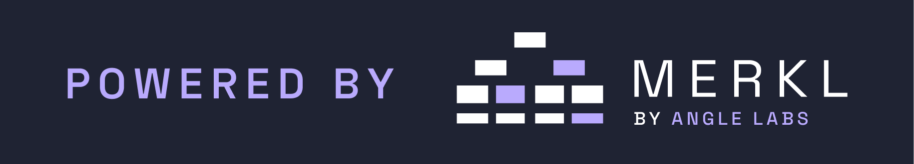
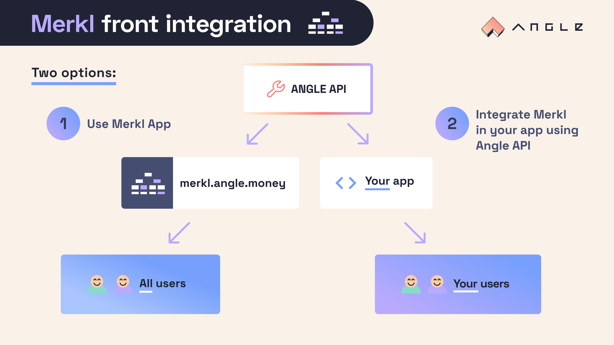

## Integrate Merkl to your App

You can integrate Merkl data directly into your application and use Merkl as a white-label solution. However, this is entirely up to you. Regardless of your choice, the [Merkl App](https://app.merkl.xyz/) offers a comprehensive interface that provides your users with everything they need to utilize Merkl, including the ability to claim their tokens directly. This guide will walk you through the various routes available via the Merkl API. 

If you choose to use Merkl as a white-label solution, you will need to integrate our logo with a clickable link that redirects to our app. Here is the link to [Merkl App](https://app.merkl.xyz/) and below is the logo you need to incorporate into your frontend:

<figure><figcaption></figcaption></figure>

<figure><figcaption></figcaption></figure>


## Merkl Front Integration: Options and Implementation

<figure><figcaption></figcaption></figure>

**The Merkl API** is fully maintained by Angle Labs, and **contains all the information needed to integrate Merkl into your frontend. Some parameters are optional, but you should kep in mind that specifying more parameters can speed up the result.**

## Merkl API

The Merkl API is available here [https://api.merkl.xyz](https://api.merkl.xyz) and contains all the data you need to track campaigns. All the data from the Merkl app is served by this API.

The swagger can be found [here](https://api.merkl.xyz/swagger)

### /v3/campaigns <a href="#campaigns-information" id="campaigns-information"></a>

Used to query all the information relative to Merkl campaigns

**Parameters**

* `chainIds` (optional): You can specify one or several Merkl supported chain Ids. If none are provided, the API will return campaigns for all chains by default.
* `live` (optional): defaults to false, if set to true the route will only return live campaigns
* `types` (optional): only return campaigns of a given type. The types are
  * 1: ERC20
  * 2: Concentrated liquidity 
  * 3: ERC20 snapshot
  * 4: Airdrops
  * 5: Silo
  * 6: Radiant emissions
  * 7: Morpho
  * 8: Dolomite
* `creatorTag` (optional): only return campaigns created by an a given creator (for this to work we need to tag the address you used to create the campaigns)

**Example requests**

* **Query all campaigns for all chains** [https://api.merkl.xyz/v3/campaigns](https://api.merkl.xyz/v3/campaigns)
* **Query all campaigns on Ethereum Mainnet** [https://api.merkl.xyz/v3/campaigns?chainIds=1](https://api.merkl.xyz/v3/campaigns?chainIds=1)
* **Query all campaigns on Ethereum Mainnet and Arbitrum** [https://api.merkl.xyz/v3/campaigns?chainIds=1\&chainIds=42161](https://api.merkl.xyz/v3/campaigns?chainIds=1\&chainIds=42161)
* **Query all live campaigns on Ethereum Mainnet** [https://api.merkl.xyz/v3/campaigns?chainIds=1&live=true](https://api.merkl.xyz/v3/campaigns?chainIds=1&live=true)
* **Query all live ERC20 campaigns on Ethereum Mainnet** [https://api.merkl.xyz/v3/campaigns?chainIds=1&live=true&types=1](https://api.merkl.xyz/v3/campaigns?chainIds=1&live=true&types=1)
* **Query all campaigns created by the Optimism Superfest address** [https://api.merkl.xyz/v3/campaigns?chainIds=1&live=true&types=1](https://api.merkl.xyz/v3/campaigns?creatorTag=superfest)

**Processing the data**

The return data is structured as follows:

* the root key is the chainId
  * under each chainId you will have a map with multiple keys, each key corresponds to an asset and a campaign type, the keys are structure as follows: `<CampaignType>_<mainParameter>` (for most types of campaigns, the mainParameter is the asset address)
    * under each `<CampaignType>_<mainParameter>` you will find a map of campaignIds for the given asset
      * the format will change depending on the campaign type but they all share the following fields
        * **chainId**: number - chain where the campaign was created
        * **index**: number - index of the campaign in the contract, can be ignored
        * **campaignId**: number - ID of the campaign, same as the key
        * **creator**: string - address that created the campaign
        * **campaignType**: number - type of the campaign
        * **campaignSubType**: number - subtype of the campaign
        * **rewardToken**: string - address of the token being distributed by the campaign
        * **priceRewardToken**: number - price of the reward token
        * **amount**: string - amount of token being distributed by the campaign
        * **startTimestamp**: number - start timestamp of the campaign in seconds
        * **endTimestamp**: number - end timestamp of the campaign in seconds
        * **mainParameter**: string - asset targeted by the campaign
        * **campaignParameters**: any - map of additional information regarding the campaign, format depends on the campaign type
        * **computeChainId**: number - chain where the incentivized asset is located
        * **tags**: string[] - creator tags
        * **apr**: number - apr of the campaign, if there are multiple campaigns for a given asset you will need to sum the aprs to get the total apr of the campaign
        * **tvl**: number - tvl of the incentivized asset

**Example data**
```json
{
  "10": {
    "2_0xb40DA71c49c745Dd3ab801882b1D410760541678": {
      "0x47e87ee5d0bc69e66646543966b782689df0ac7716fa580b69b163dc0616cbcd": {
        "chainId": 10,
        "index": 217,
        "campaignId": "0x47e87ee5d0bc69e66646543966b782689df0ac7716fa580b69b163dc0616cbcd",
        "creator": "0xd0Db870a674A1B8b82FB18F1C295736B3b965701",
        "campaignType": 2,
        "campaignSubType": 0,
        "rewardToken": "0x4200000000000000000000000000000000000042",
        "amount": "7500000000000000000000",
        "amountDecimal": "0",
        "startTimestamp": 1722938400,
        "endTimestamp": 1724148000,
        "mainParameter": "0xb40DA71c49c745Dd3ab801882b1D410760541678",
        "campaignParameters": {
          "amm": 0,
          "url": "https://app.uniswap.org/explore/pools/optimism/0xb40DA71c49c745Dd3ab801882b1D410760541678",
          "token0": "0x1F32b1c2345538c0c6f582fCB022739c4A194Ebb",
          "token1": "0x2416092f143378750bb29b79eD961ab195CcEea5",
          "ammAlgo": 0,
          "poolFee": "0.01",
          "duration": 1209600,
          "blacklist": [],
          "whitelist": [],
          "forwarders": [],
          "weightFees": 4000,
          "poolAddress": "0xb40DA71c49c745Dd3ab801882b1D410760541678",
          "symbolToken0": "wstETH",
          "symbolToken1": "ezETH",
          "weightToken0": 3000,
          "weightToken1": 3000,
          "boostedReward": 0,
          "boostedAddress": "0x0000000000000000000000000000000000000000",
          "decimalsToken0": 18,
          "decimalsToken1": 18,
          "symbolRewardToken": "OP",
          "decimalsRewardToken": 18,
          "isOutOfRangeIncentivized": false
        },
        "computeChainId": 10,
        "tags": [
          "superfest"
        ],
        "amm": 0,
        "ammAlgo": 0,
        "ammAlgoName": "UniswapV3",
        "ammName": "UniswapV3",
        "apr": 50.93152684877548,
        "aprs": {
          "Average APR (rewards / pool TVL)": 50.93152684877548,
          "APR for holding wstETH in pool": 40.5856583057182,
          "APR for holding  ezETH in pool": 24.504937823499315
        },
        "blacklistedBalance0": 0,
        "blacklistedBalance1": 0,
        "blacklistedLiquidity": 0,
        "forwarders": [],
        "isBoosted": false,
        "isLive": true,
        "isMock": false,
        "poolBalanceToken0": 63.46559700542308,
        "poolBalanceToken1": 121.45932060025895,
        "poolTotalLiquidity": 158865.61727916493,
        "symbolToken0": "wstETH",
        "symbolToken1": "ezETH",
        "tick": 1480,
        "priceRewardToken": 1.3,
        "tvl": 499094.459363415
      }
    }
  }
}
```

### /v3/campaignsForMainParameter

Returns all the campaigns for a given `mainParameter`.

**Parameters**

* `chainId`: Merkl supported chain Id. In this instance, `chainId` is mandatory.
* `mainParameter`: Address of the incentivized asset (pool address for concentrated liquidity campaigns, ERC20 address for ERC20 campaigns, etc.).

**Example requests**

* **Query campaigns on the wstETH/USDT Univ3 pool** (`mainParameter=``0xeC5055067d60292Ab2c514A1090Bc8E014e4aBAA`) **on Ethereum  Mainnet** (`chainId=1`). [https://api.merkl.xyz/v3/campaignsForMainParameter?chainId=1\&mainParameter=0xeC5055067d60292Ab2c514A1090Bc8E014e4aBAA](https://api.merkl.xyz/v3/campaignsForMainParameter?chainId=1\&mainParameter=0xeC5055067d60292Ab2c514A1090Bc8E014e4aBAA)

**Response Template**

```
{
  campaignId: string;
  campaignType: number;
  rewardToken: string;
  rewardTokenSymbol: string;
  amountDecimal: string;
  startTimestamp: number;
  endTimestamp: number;
}[];
```

### /v3/recipients

Returns all the rewarded addresses of a given campaign.

**Parameters**

* `chainId`: Merkl supported chain Id. In this instance, `chainId` is mandatory.
* `campaignId`: Campaign Id of the campaign.

You can find the `campaignId` of the campaign by calling the [/v3/campaigns](./#campaigns-information-1) or [/v3/campaignsForMainParameter](./#v3-campaignsformainparameter)

**Example requests**

* **Query the campaign on Arbitrum** (`chainId=42161`) with `campaignId=0x2bba7ce636dcd4ddd2ea70f790729cdc87510327074aa3f5df8a3aeb3f54f7d0` [https://api.merkl.xyz/v3/recipients?chainId=42161\&campaignId=0x2bba7ce636dcd4ddd2ea70f790729cdc87510327074aa3f5df8a3aeb3f54f7d0](https://api.merkl.xyz/v3/recipients?chainId=42161\&campaignId=0x2bba7ce636dcd4ddd2ea70f790729cdc87510327074aa3f5df8a3aeb3f54f7d0)

**Response**

```
{
  recipient: string;
  reason: string;
  rewardToken: string;
  amount: string;
}
[];
```

### /v3/userRewards

Returns all rewards linked to a user on a given chain. Data can be filtered by providing parameters.

**Parameters**

* `user`: Address of the user.
* `chainId`: Merkl supported chain Id. In this instance, `chainId` is mandatory.
* `rewardToken` (optional): Address of the token rewarded to the users.
* `mainParameter` (optional): Address of the incentivized asset (pool address for concentrated liquidity campaigns, ERC20 address for ERC20 campaigns, etc.).
* `proof` (optional): Defaults to false. Allows you to choose whether or not to include proof of rewards. This cannot be set to true if `mainParameter` is specified, as the proof could be invalid if the user has unclaimed rewards of the same reward token earned over different `mainParameters`.

**Example requests**

* **Query all rewards earned on Ethereum** ( `chainId=1`) **by a user** (`user=0xfdA462548Ce04282f4B6D6619823a7C64Fdc0185`).  [https://api.merkl.xyz/v3/userRewards?user=0xfdA462548Ce04282f4B6D6619823a7C64Fdc0185\&chainId=1](https://api.merkl.xyz/v3/userRewards?user=0xfdA462548Ce04282f4B6D6619823a7C64Fdc0185\&chainId=1)
* **Query all ANGLE** (`rewardToken=0x31429d1856aD1377A8A0079410B297e1a9e214c2`) **rewards earned on Ethereum Mainnet** ( `chainId=1`) **by a user** (`user=0xfdA462548Ce04282f4B6D6619823a7C64Fdc0185`). [https://api.merkl.xyz/v3/userRewards?user=0xfdA462548Ce04282f4B6D6619823a7C64Fdc0185\&chainId=1\&rewardToken=0x31429d1856aD1377A8A0079410B297e1a9e214c2](https://api.merkl.xyz/v3/userRewards?user=0xfdA462548Ce04282f4B6D6619823a7C64Fdc0185\&chainId=1\&rewardToken=0x31429d1856aD1377A8A0079410B297e1a9e214c2)
* **Query all rewards earned on the wstETH/USDT Univ3 pool** (`mainParameter=0xeC5055067d60292Ab2c514A1090Bc8E014e4aBAA`) on Ethereum Mainnet (chain** `chainId=1`) **by a user** (`user=0xfdA462548Ce04282f4B6D6619823a7C64Fdc0185`). [https://api.merkl.xyz/v3/userRewards?user=0xfdA462548Ce04282f4B6D6619823a7C64Fdc0185\&chainId=1\&mainParameter=0xeC5055067d60292Ab2c514A1090Bc8E014e4aBAA](https://api.merkl.xyz/v3/userRewards?user=0xfdA462548Ce04282f4B6D6619823a7C64Fdc0185\&chainId=1\&mainParameter=0xeC5055067d60292Ab2c514A1090Bc8E014e4aBAA)
* **Query all rewards earned by a user** (`user=0xfdA462548Ce04282f4B6D6619823a7C64Fdc0185`) **to build a claim transaction** (`proof=true`) **on Ethereum Mainnet** (`chainId=1`)  [https://api.merkl.xyz/v3/userRewards?user=0xfdA462548Ce04282f4B6D6619823a7C64Fdc0185\&chainId=1\&proof=true](https://api.merkl.xyz/v3/userRewards?user=0xfdA462548Ce04282f4B6D6619823a7C64Fdc0185\&chainId=1\&proof=true)

**Response**

```
{
    [rewardTokenAddress: string]: {
        accumulated: string;
        decimals: number;
        symbol: string;
        reasons: {
          [reason: string]: {
            accumulated: string;
            unclaimed: string;
          }
        }
        symbol: string;
        unclaimed: string;
        proof?: string[]
    }
}
```

To submit a [claim transaction](https://etherscan.io/address/0x3Ef3D8bA38EBe18DB133cEc108f4D14CE00Dd9Ae#writeProxyContract#F1) you should map the data returned by this route as follows:

* Users: `["<Address used for the request>"]`
* Tokens: `["<Address of the token you want to claim>"]`
* Amounts: `[data["<chain on which you want to claim>"].tokenData["<Address of the token you want to claim>"].accumulated]`
* Proofs: `[data["<chain on which you want to claim>"].tokenData["<Address of the token you want to claim>"].proofs]`

You can get the Merkl Distributor contract abi [here](https://etherscan.io/address/0x22b0ac22d5d58f05873e470bca5db7ceb5c47f5e#code). It is the same ABI on all chains.

**Claiming user rewards**

Rewards are claimable per token: meaning that if you have accumulated rewards of several tokens, you may choose to only claim your rewards of one token type, but you may also choose to claim all your token rewards at once.

The contract on which rewards should be claimed is the `Distributor` contract which address can be found on at this [page](../../general-information/smart-contract-address.md) or on the [Angle SDK](https://github.com/AngleProtocol/sdk).

You have two options to claim rewards:

* **Rely on the data provided by this route (recommended):** We build the claim transaction payload and the associated proof, for you. Simply call our API. This is the example shown below.
* **Build the proof yourself:**  Built the proof yourself and join it to the transaction data from the API. You can find a Github repository below showing how to do that.

In any case, if a call is made to the correct `Distributor` contract and the `token` or `amount` doesn't match the `proof`, the transaction will revert.

Here is a script you may use to claim all the token rewards for a user on a chain.

```
import {
  Distributor__factory,
  MerklAPIData,
  registry,
} from "@angleprotocol/sdk";
import { JsonRpcSigner } from "@ethersproject/providers";
import axios from "axios";

export const claim = async (chainId: number, signer: JsonRpcSigner) => {
  let data: MerklAPIData["transactionData"];
  try {
    data = (
      await axios.get(
        `https://api.merkl.xyz/v3/userRewards?chainId=${chainId}&user=${signer._address}&proof=true`,
        {
          timeout: 5000,
        }
      )
    ).data;
  } catch {
    throw "Angle API not responding";
  }
  const tokens = Object.keys(data).filter(
    (k) => data[k].proof !== undefined || data[k].proof !== []
  );
  const claims = tokens.map((t) => data[t].accumulated);
  const proofs = tokens.map((t) => data[t].proof);

  if (tokens.length === 0) throw "No tokens to claim";

  const contractAddress = registry(chainId)?.Merkl?.Distributor;
  if (!contractAddress) throw "Chain not supported";
  const contract = Distributor__factory.connect(contractAddress, signer);
  await (
    await contract.claim(
      tokens.map((t) => signer._address),
      tokens,
      claims,
      proofs as string[][]
    )
  ).wait();
};
```

If you want to build the proof yourself please reach out to us on Telegram, we'll be glad to help!

### /v3/rewards

This route was made for the Angle Labs Merkl frontend. To get user rewards, we recommend using `/v3/userRewards` as it is faster and returns more specific information.

`/v3/rewards`returns all the rewards accumulated by a user, the merkl proofs needed for the claim transaction, and the campaign information.

**Parameters**

* `user`: Address of the user.
* `chainIds` (optional): One or several Merkl supported chain Ids. If none are provided, the API will return rewards for all chains.

**Response**

Copy

```
{
  [chainId: number]: {
    tokenData: {
      [token: string]: {
        accumulated: string;
        unclaimed: string;
        decimals: number;
        symbol: string;
        proof: string[];
      };
    };
    campaignData: {
      [campaignId: string]: {
        [reason: string]: {
          accumulated: string;
          unclaimed: string;
          token: string;
          decimals: number;
          symbol: string;
          mainParameter: string;
          auxiliaryData1: string;
          auxiliaryData2: string;
        };
      };
    };
  };
}
```

### Listing incentivized pools <a href="#listing-incentivized-pools" id="listing-incentivized-pools"></a>

When called for a specific chain, the API returns in a `pools` object a mapping between pool addresses of this chain (like Uniswap V3 pool addresses) and details on the APRs for providing liquidity.

**Note: Due to the nature of concentrated liquidity AMMs and the script's workings, two LPs with different positions may earn drastically different returns. Therefore, APRs displayed here are average measures of the returns LPs can earn. If you integrate Merkl into your app, you may want to build APR indicators tailored to your use cases.**

The `pools` object also includes details about past distributions for each incentivized pool, such as start and end dates, parameters set, and the amount of incentives for each distribution. You can filter the `pools` object to display only the pools of your choice (e.g., pools with tokens in a subset and with an active distribution).

### Displaying user rewards <a href="#displaying-user-rewards" id="displaying-user-rewards"></a>

The `rewardsPerToken` object allows you to see how many rewards of a specific token can be claimed by a user for a specific pool. This object maps each reward token to the total amount of rewards accumulated on the pool for a user. It includes both the rewards that have already been claimed and the amount of unclaimed tokens on the pool. It also details where these tokens have been earned (e.g., Uniswap V3, Gamma).
