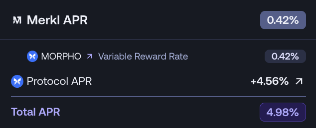

# Display your native APR

Merkl enables protocols to display their native APR directly on the Merkl frontend alongside Merkl incentive APRs. This integration provides users with a comprehensive view of total returns available on your protocol.

## Overview

By integrating your native APR data, you can:

- Display protocol-specific APRs (e.g., lending yields, staking rewards, pool fees) on Merkl's frontend
- Help users understand the full return potential when combining native yields with Merkl incentives
- Increase visibility and transparency for your protocol's offerings

<figure><figcaption><p>Native APR integration within Merkl frontend</p></figcaption></figure>

## Implementation

### Endpoint Requirements

To integrate your native APR data, you must create and host a public API endpoint that returns APR data in the following JSON format:

```json
[
  {
    "title": "Protocol Name APR",       // Required: String - Display name for the APR (e.g., "Aave Supply APR", "Uniswap Fee APR")
    "opportunityId": "123...abc",     // Required: String - The Merkl Opportunity ID this APR corresponds to
    "timestamp": 1716900000,            // Required: Number - Unix timestamp in seconds when the APR was calculated
    "value": 5.5,                       // Required: Number - The APR as a percentage (e.g., 5.5 for 5.5%)
    "description": "Optional details"   // Optional: String - Additional context about the APR calculation
  },
  {
    "title": "Protocol Name APR",
    "opportunityId": "0x456...def",
    "timestamp": 1716900000,
    "value": 12.4
  }
]
```

### Field Descriptions

- **title**: A clear, descriptive name for the APR type (e.g., "Aave Supply APR", "Compound Borrow APR", "Uniswap V3 Fee APR")
- **opportunityId**: The unique identifier for the Merkl opportunity. To identify the correct `opportunityId` values for your protocol's opportunities, you can query the Merkl API to retrieve opportunity Ids for the opportunities related to your protocol.
- **timestamp**: When the APR value was last calculated or updated, in Unix timestamp format (seconds)
- **value**: The APR value as a percentage. For example, use `5.5` to represent 5.5% APR
- **description** (optional): Additional information about how the APR is calculated or what it represents

### Next Steps

Once you have prepared your endpoint:

1. Test your endpoint to ensure it returns data in the correct format
2. Verify that all opportunity IDs are accurate
3. Contact the Merkl team to register your endpoint and complete the integration


**Important**: All APR data must be accurate and verifiable. Providing misleading, incorrect, or manipulated data will result in immediate removal of your integration from the Merkl frontend.

Ensure that:

- APR calculations are accurate and reflect actual protocol performance
- Timestamps are current and updated regularly
- Values are consistently formatted as percentages



If you have questions or need assistance, please reach out to the Merkl team.
