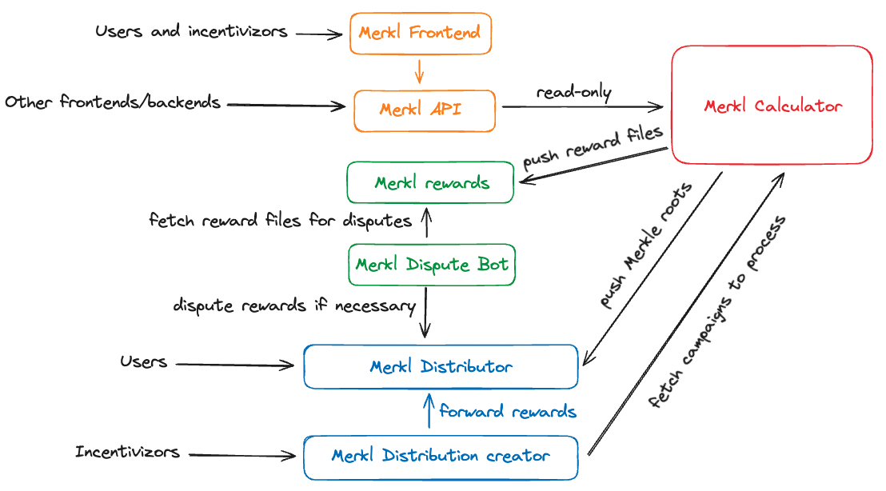

# ⚙️ Merkl Mechanism

Merkl is based on an off-chain script that looks at on-chain data to measure user behavior and split the rewards between all eligible users based on the rules set by the incentivizor. Based on this, the script aggregates all reward distribution data in a Merkle tree, then compresses it into a Merkle root and pushes on-chain to allow LPs to claim their rewards.

The script is ran regularly for the period between when it is executed and its last execution. Every time the script is ran, it only looks at the on-chain data related specifically to this period of time.

Merkl can be split into 7 components which we will describe one by one:

- 2 smart contracts deployed on each chain supported by Merkl
  - Merkl Distribution Creator
  - Merkl Distributor
- 4 off-chain components hosted by Angle Labs
  - The Merkl calculator (private) which computes rewards and pushes new merkle roots onchain
  - A public frontend
  - A public API
  - A rewards bucket which holds all the historical reward files and from which anyone can re-build the Merkl root
- 1 off chain component which can be hosted by anyone
  - The Merkl Dispute bot

The components interact in the following way:

1. An incentivor creates a campaign on the **Merkl Distribution Creator** contract
2. When the campaign is created, the incentive tokens (what users will receive) are forwarded to the **Merkl Distributor** contract
3. At fixed intervals the **Merkl Calculator** fetches the campaigns to process from the **Merkl Distribution Creator** contract, processes the campaigns to compute the rewards, computes a new merkle root from the result of the previous process and pushes the new merkle root to the **Merkl Distributor** contract. It also pushes a reward file to the **Merkl Rewards** bucket.
4. When the root is pushed to the contract the dispute period starts, the dispute period lasts 1 hour and the newly pushed rewards cannot be claimed until the dispute period ends.
5. The **Merkl Dispute bots** fetch the reward file, re-compute the merkle root from it and verify that the allocation of the rewards is valid. If the merkle root cannot be re-computed or if the rewards are invalid, the bots can dispute the merkle root. No rewards can be claimed until the dispute is resolved.
6. Once the dispute period is over, users can see their rewards on the **Merkl Frontend** or any other frontend integrated with the **Merkl API**
7. The users claim their rewards from the **Merkl Frontend**, the merkle proofs needed to claim the rewards are provided by the **Merkl API**. These proofs can also be computed using the reward files from the **Merkl Rewards** bucket and the **Merkl API** can be used by any other frontend.

## Merkl smart contracts

The merkl smart contracts have been developed in-house by Angle Labs, the source code can be found [here](https://github.com/AngleProtocol/merkl-contracts).

Both contracts are managed through a `CoreMerkl` contract managed by a multisig which has the power to settle disputes, change dispute parameters, to modify fees and their recipients, and to whitelist new addresses allowed to modify merkle roots in the `Distributor` contract. It has no ability to alter distributions.

### Merkl Distribution Creator

The Distribution creator contract is used by incentivizors to create campaigns. A detailed documentation can be found [here](https://todo.com). This contract holds no funds and is only used to store the campaigns and all their rules. When calculating rewards, the Merkl Calculator fetches the campaigns and their configuration straight from this contract.

### Merkl Distributor

The Merkl distributor is used by users to claim their rewards. This contract holds all the tokens that will be distributed to the users, if you want to know the "TVL" of Merkl on a given chain this is the contract you should be looking at. The tokens can only be claimed by providing merkle proofs which match with the current merkle root. A new merkle root is pushed every time the calculator computes new rewards.

## Merkl off-chain components hosted by Angle Labs

### Merkl calculator

This is the most critical component of the whole system, as such, it is fully isolated and cannot be accessed from the internet. In short, at regular time intervals (between 3 and 12 hours depending on the chain) this component:

- fetches campaigns from the Merkl Distribution creator contracts
- creates independent processes for each campaign which all run in parallel. Each process executes the following actions:
  - validates that the configuration of the campaign is correct
  - checks how much rewards have already been distributed for that campaign and when they were last distributed
  - fetches onchain data from RPC nodes, subgraphs or other solutions to measure user activity and reward users based on these metrics.
  - runs a several sanity checks to avoid a dispute. If an issue is detected the script will retry to compute the rewards up to 3 times, after the third time the new rewards from the campaign will be omitted in the new reward file to avoid blocking the whole system for a single campaign. These rewards will be recomputed at a later time.
  - creates a partial reward file for that campaign
- aggregates all the partial reward files into one and computes a new merkl root
- pushes the new merkle root on chain.

### Merkl rewards bucket

This bucket contains all the reward files generated by the Merkl Calculator. It has 2 main purposes:

1. It is used by the dispute bots to validate that the rewards were distributed correctly
2. It allows anyone to have a closer look at the raw output of the Merkl Calculator


If the Merkl Calculator pushes a new root but does not push a reward file to this bucket within the first 30 minutes after the upload of the root, the merkle root will be disputed.


### Merkl API

This API is provided by Angle Labs to allow anyone to easily access Merkl related data (current rewards, APRs, merkl proofs for claims, merkl analytics etc.)

This API is used by the Merkl frontend and by the frontends of incentivizors who want their users to be able to interact with Merkl directly from their app.

A more detailed documentation of this API can be found [here](https://todo.com)

### Merkl frontend

A frontend provided by Angle Labs to allow users to easily see all the Merkl campaigns, the associated APRs and of course claim their rewards. Technically any other team could set up a dedicated Merkl frontend as it fetches all of its data from the Merkl API which is fully public!

## Merkl Dispute bot

The dispute bot is the second most important component of Merkl as it prevents invalid rewards from being claimed by users. It is fully open sourced and can be deployed by anyone, the source code can be found [here](https://github.com/AngleProtocol/merkl-dispute).

The more dispute bots are active the merrier, feel free to reach out to the Angle Labs team if you're having issues deploying this bot, we'll be more than happy to help!

### 🤺 Dispute Periods

The script computing rewards and updating the reward Merkle root on-chain is ran by Angle Labs. Merkle roots pushed on-chain are based on off-chain computations from on-chain data. Anyone can fetch the on-chain data required to run the script and verify the results sent.

To allow anyone to permissionlessly verify that the system is working properly, and to reduce the system's exposure to potential hacks or failures, every new Merkle root update is followed by a dispute period. A new Merkle root that aggregates reward distribution data for a chain is only effective after this dispute period.

Anyone can contest the result of a distribution during the dispute period. A dispute can be triggered by sending a pre-defined amount of `disputeToken` (agEUR) to the contract distributing rewards. During a dispute, the Merkle root of the distribution contract is frozen to its last valid version. Disputes can then either be considered as valid, in which case the disputer is refunded and the disputed Merkle root is revoked, or invalid. If it is invalid the disputer loses its funds and the dispute period is restarted from scratch (which means the disputed tree is still not considered valid).

Dispute token, amount, and length can be obtained by directly querying the contract handling reward distribution on the chain of interest.
