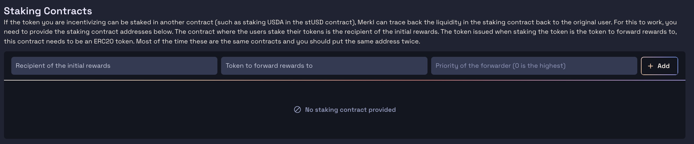

# ERC20 Mechanisms

## **Why Do ERC20 Campaigns Incorporate Token Balance, LP Token Balance, and Lending and Borrowing Protocols?**

ERC20 campaigns incorporate various aspects such as token balance, LP token balance (constant product liquidity pools such as UniSwapV2), and lending and borrowing protocols. Since all these protocols are based on ERC20 tokens, Merkl can integrate them by default, ensuring that users participating in different activities can earn rewards.

However, for Constant Product AMMs and lending and borrowing protocols, **we strongly recommend you to be fully supported by Merkl**. The advantages of being supported by Merkl include APR and TVL calculations, among other benefits. Additionally, you can create protocol-specific types of campaigns for more tailored incentives.

The current supported lending and borrowing protocols by Merkl are:

* Silo (protocol-specific campaigns)
* Radiant (protocol-specific campaigns)
* Compound
* Gearbox
* Ionic
* Sturdy
* Metamorpho Lending

Merkl also currently support the following Constant Product AMMs:

* Uniswap V2
* Balancer V2
* Velodrome V2
* Aerodrome V2
* Fenix V2
* Poolside V2
* Quickswap V2

If you want your Constant Product AMM, or lending and borrowing protocol to be fully integrated and supported by Merkl, or to create tailored protocol-campaigns (as we did for Silo and Radiant), please [contact us on the Merkl Discord by opening a BD ticket](https://discord.com/invite/jnYfrGxDbe) to discuss the integration process. **Integration allows APRs and TVL calculations**.

### How it All Comes Together

1. **Token Balance:** Users holding ERC20 tokens in their wallets are rewarded based on their token balance.

* Reward distribution is proportional to the percentage of the total token supply that a user holds. For example, if a user holds 1% of the total token supply, they are eligible for 1% of the reward pool (assuming no addresses have been blacklisted).
* If some addresses are blacklisted, the user's share of the reward pool will increase proportionally. In this case, the user will receive the same percentage of the rewards that the blacklisted addresses would have collected if they were not blacklisted. This ensures that the total rewards are distributed fairly among the eligible participants.

2. **LP Token Balance:** Users providing liquidity in a Constant Product liquidity pool (such as on UniSwapV2) earn rewards based on their LP token balance.

* Reward distribution follows the same rationale as explained for the rewards distribution for token balance.

3. **Lending and Borrowing Protocols:** For lending and borrowing protocols that work with emitting receipt and debt tokens (i.e., ERC20 tokens), users lending assets will receive a receipt token, while those borrowing will receive a debt token. The reward distribution mechanism is as follows:

* Rewards are distributed proportionally based on the percentage of the debt or receipt token supply that a user owns per incentivized asset.
* If there are blacklisted addresses, the distribution adjusts similarly to how it would for token or LP token balances. The user's share of the reward pool will increase proportionally to account for the rewards that would have gone to the blacklisted addresses, ensuring a fair distribution among eligible participants.

## ERC20 Forwarders: Staking Mechanism

Merkl supports a staking mechanism where users can earn rewards even if the incentivized asset is not directly present in their wallet.

For example, for a USDa incentivization campaign, users who staked their USDa and receive stUSD in exchange can still be eligible to earn rewards. The forwarder includes users who have staked their USDa, ensuring they receive rewards despite not having the original tokens in their wallets since their USDa are locked in the stUSD smart contracts. To learn more about USDa, and stUSD, you can check Angle Protocol's [website](https://www.angle.money/) and [documentation](https://docs.angle.money/) - Angle Labs is the company that developed Merkl and is a key contributor to Angle Protocol's stablecoins (USDa and EURa) and saving products (stUSD and stEUR).

Here's how it works:

* **Staking Example:** Users stake their EURa or USDa and receive stEUR or stUSD tokens in return.
* **Forwarding Mechanism:** Although the staked tokens (EURa or USDa) are not in the user's wallet (as they are held in the stEUR or stUSD smart contracts), users are still rewarded based on their stEUR or stUSD holdings.
* **Reward Eligibility:** Merkl's forwarding mechanism ensures that users with stEUR or stUSD in their wallets can earn rewards, recognizing their stake in the original tokens.

**As a result, if the token you are incentivizing can be staked in another contract (such as staking USDa in the stUSD contract), Merkl can trace back the liquidity in the staking contract to the original user.** For this to work, you need to provide the staking contract addresses (see screenshot below). The contract where users stake their tokens is the **recipient of the initial rewards**. The token issued when staking the token is the **token to forward rewards to**, and this contract needs to be an ERC20 token. Most of the time, these are the same contracts, so you should enter the same address twice.

<figure><figcaption></figcaption></figure>
