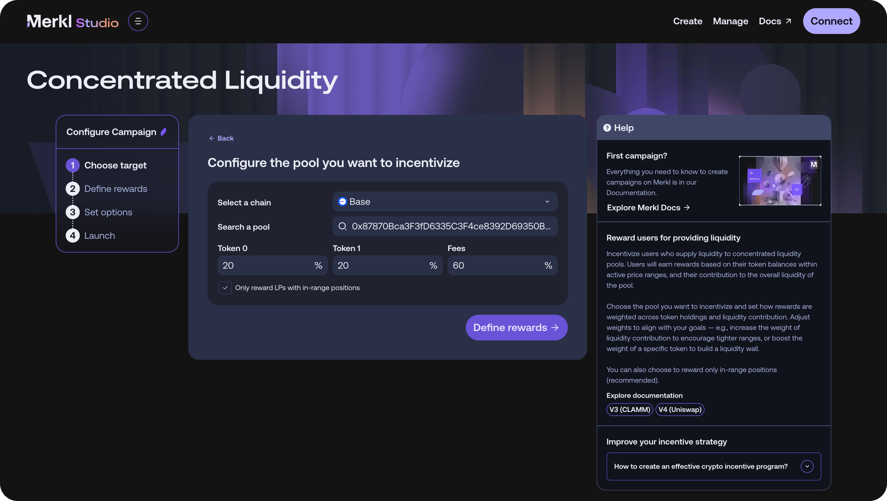

# Concentrated Liquidity Campaigns

## 🌐 Overview

Merkl’s Concentrated Liquidity campaigns allow campaign creators to reward Liquidity Providers (LPs) on concentrated liquidity AMMs like Uniswap V4, Uniswap v3, Quickswap, and Sushiswap.

Unlike traditional incentives where users are rewarded based on deposit amount, Concentrated Liquidity campaigns reward LPs based on **how they provide liquidity** — within specific price ranges — **and their contribution to the overall liquidity of the pool.**

LPs who provide liquidity in optimal, high-impact ranges are rewarded more generously, ensuring capital efficiency.

<figure><figcaption></figcaption></figure>

## 🔢 Reward formula

When campaign creators launch concentrated liquidity campaigns, they define:

* The pool to be incentivized (using the **pool address or ID**)
* A **reward period**
* A set of **incentive parameters**, which define how rewards will be distributed among liquidity providers.
  * **Fees earned**: The fees earned by the position during the period, which represent the liquidity of the position used by the pool.
  * **Token 0 holding**: The share of token 0 held by a position relative to the total token 0 in the pool.
  * **Token 1 holding**: The share of token 1 held by a position relative to the total token 1 in the pool.

Each factor is assigned a weight (`w_fees`, `w_0`, `w_1`), which the campaign creator defines when setting up the campaign in Merkl Studio.

Merkl analyzes swaps within the pool during the incentive period and assigns rewards based on these 3 parameters.

With this setup, this is as if the overall incentive budget was split in 3, with a proportion being shared by LPs based on how much fees they've earned, a proportion shared based on the overall amount of token 0 they've held and a last portion based on the relative token 1 balance they've had in their position during the time period.


In the context of **Uniswap v4**, the "Fee earned" parameter is no longer taken into account. It is replaced by **"Liquidity Contribution"**, which measures the **time-weighted contribution of a position to the overall liquidity in the pool**. Positions that remain tightly concentrated around the active tick contribute more liquidity—assuming equal TVL—than those spread across a wider range.

For example, a position might generate high fees during a short burst of activity, but if it wasn’t consistently concentrated throughout the reward period, it won’t earn significant rewards. What matters here is **sustained concentration over time**, not short-term volume or swap activity.



Building on its Uniswap v3 foundation, Merkl's integration with Uniswap v4 brings major enhancements—delivering a more performant, stable, and JIT attack-resistant reward mechanism.

The system enables precise measurement of liquidity over time, resulting in more deterministic and reliable attribution of LP contributions while minimizing the influence of short-term volatility.


### 🧮 Example Calculation

#### Uniswap v3 and similar AMM

If incentive weights are set as:

* Fees = 40%,
* Token 0 = 30%,
* Token 1 = 30%,

Then:

* A user earning 50% of total pool fees receives 20% of total rewards (50% × 40%).
* A user holding 30% of Token 0 receives 9% of total rewards (30% × 30%).
* A user holding 20% of Token 1 receives 6% of total rewards (20% × 30%).

#### Uniswap v4

If incentive weights are set as:

* Liquidity contribution = 50%
* Token 0 = 25%
* Token 1 = 25%

Then:

* A user representing 40% of the total liquidity in the pool (and hereby earning \~40% of the fees accruing to the pool) receives 20% of total rewards (40% × 50%).
* A user holding 30% of Token 0 receives 7.5% of total rewards (30% × 25%).
* A user holding 20% of Token 1 receives 5% of total rewards (20% × 25%).

## ♟️ Reward strategy examples

Campaign creators can fine-tune parameters to match their objectives:

* **Encouraging deep liquidity:** Increasing the weight of liquidity contribution / fee earned to encourage deep liquidity in high-volume trading ranges.
* **Stablecoin peg protection:** To help maintain a stablecoin peg (e.g., USDC), increasing the weight of Token 0 rewards can encourage LPs to hold more of the pegged token in the pool, discouraging dumps and supporting stability.
* **Optimized tight range incentives:** With Uniswap V4 Hooks, LPs can implement automated rebalancing strategies to maintain optimal tight-range positions and maximize reward efficiency.

Here are some suggestions depending on your needs and pool type:

* For stable pools/pegged pools (e.g., USDC/USDT or WBTC/BTC): Liquidity contribution = 80%, token0 = 10%, token1 = 10%
* For volatile pools (e.g., WETH/USDC): Liquidity contribution = 20%, token0 = 40%, token1 = 40% (the higher the volatility, the higher the weights for token0 and token1 percentages should be)
* You can also refer to the Merkl blog about [liquidity walls](https://blog.merkl.xyz/merkl-insights-how-can-incentives-prevent-your-token-from-dumping) explaining how to prevent a token from dumping, or a stablecoin from losing its peg


Merkl is not responsible for defining your strategy and targets. Nevertheless, you can refer to live campaigns to look for typical APRs and/or weight fees parameters on similar campaigns.


## 💉 Sampling and Anti-DoS

For large, high-activity pools in Uniswap v3 and similar AMMs, Merkl samples the largest swaps rather than processing every transaction.

* Out-of-range positions detected during sampled swaps are excluded from rewards.
* Users earning less than 0.0000001% of total rewards are filtered out.
* Positions with less than $10 liquidity are disqualified.

To maximize rewards, LPs should actively manage their positions to stay in-range.

On the other hand, Uniswap V4 incentive distribution leverages Merkl's `LogProcessor` algorithm, which continuously tracks **the state of each pool in real time.**

As a result, each campaign calculates an average value for each position, ensuring users are rewarded based on both the size of their position and how long they keep it open.

## ⛔ Out of range liquidity

Campaign creators can choose whether to reward out-of-range liquidity. By default, only in-range positions receive rewards.

We strongly recommend incentivizing in-range liquidity, as this ensures active liquidity provision and avoids rewarding idle capital.

## 🔎 Fake volume attacks detection

Merkl automatically detects and blacklists users attempting to game the system via:

* Wash trading: Creating tight positions and self-trading to earn rewards.
* Frequent rebalancing: If mistaken for wash trading, may trigger blacklisting.

## ☑️ Tick price limits & eligibility on Uniswap v4

To qualify for rewards under a campaign with a tick price limits eligibility rule, a liquidity position must meet both of the following conditions:

* (if set by the campaign creator) Upper Tick Price must be below the specified `threshold_0`: Upper Tick Price < `threshold_0`
* (Resp.) Lower Tick Price must be above the specified threshold: Lower Tick Price > `threshold_1`

Here, price refers to the ratio of token 1 to token 0. For example, if token 1 is ETH and token 0 is BTC, the price reflects the ETH/BTC exchange rate.

This rule ensures that only positions providing liquidity within a targeted price range are eligible for rewards. Positions exceeding these limits on either side are not eligible.

Example:

Suppose the thresholds are:

* Upper Price Threshold = 1,050 token 1 per token 0
* Lower Price Threshold = 950 token 1 per token 0

Then:

* A position from 960 to 1,040 qualifies (upper < 1,050, lower > 950).
* A position from 940 to 1,020 does not qualify (lower < 950).
* A position from 990 to 1,080 does not qualify (upper > 1,050).

This setup encourages liquidity within a narrow, strategic price corridor, optimizing depth and efficiency around critical price levels.


The thresholds are set independently — it is possible to define a limit for the upper tick price without setting one for the lower tick price (and vice versa).


## 📈 APRs calculation

APRs shown on the Merkl interface for concentrated liquidity campaigns represent average values. They are calculated by dividing the annualized reward emissions for a pool by its current TVL.

However, actual APR varies per position. A position may earn more or less than the displayed average depending on factors like:

* How tightly liquidity is concentrated
* How others are providing liquidity
* The weight of campaign’s parameters

Example:

* If fees = 99%, a full-range position may earn minimal rewards despite providing high liquidity.
* If Token A = 60% and Token B = 10%, LPs holding more Token A will earn disproportionately higher rewards and you may be better off skewing your position so it has more of token A than of token B.
