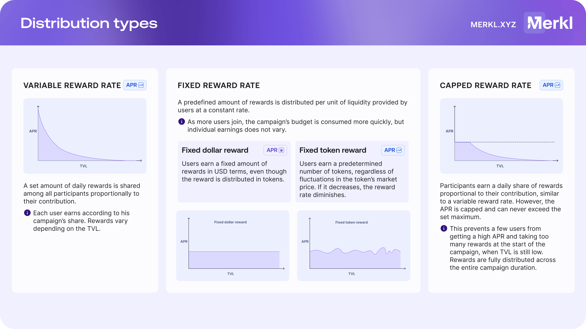

# Distribution Types

Merkl supports various distribution methods, allowing campaign creators to choose how rewards are allocated based on participant activity and liquidity contributions.

<figure><figcaption></figcaption></figure>

## 📈 Variable Reward Rate Campaigns

In variable reward rate campaigns, rewards are distributed proportionally based on time-weighted liquidity within the eligibility pool.

This is the most classical form of campaign.

### Key Characteristics

* Constant reward rate for campaign creators: A fixed amount of tokens is distributed per second, regardless of liquidity changes.
* Variable APR for participants: As more users join, rewards per user decrease (like slicing a fixed-size pizza into more pieces).
* Prefunded & fixed duration: The full campaign budget is deposited upfront, and the campaign runs for a set time.

### Example: Liquidity Pool Incentives

Imagine an incentive program targeting liquidity in a pool:

* Day Start: Two LPs each contribute $100 (50%/50%).
* Midday: A third LP adds $200 (total pool: $400).

As a result:

* The first two LPs each get 50 tokens for their contribution in the first half of the day, then 25 tokens each for the second half.
* The third LP, who contributed $200 in the second half, receives 50% of the rewards for that period, which is 50 tokens.

Result: Early participants earn more rewards before new LPs enter, while later participants dilute the total yield for others.

### Anti DoS Measures

To prevent excessive computational load and spam, Merkl applies an anti-DoS filter to Variable APR campaigns.

* Users earning less than 0.000001% of total campaign rewards per engine run are excluded.
* This prevents micro-distributions that could disrupt system performance.

Example: Uniswap V2 Liquidity Pool Campaign

* Campaign Duration: 14 days
* Total Value Locked (TVL): $1,000,000 (on Arbitrum)
* Merkl Engine Run Frequency: Every 4 hours (6 times per day)

For this campaign:

* Each reward distribution releases 1/84th of the total rewards (1 / (14 days × 6 runs per day)).
* If a user provides $10 of liquidity, they represent 1/100,000th (0.001%) of the total TVL ($10 / $1,000,000).
* Per engine run, their potential reward would be 1/8,400,000th (0.000012%) of the total rewards (1/100,000 × 1/84).
* Since this is above the 1/100,000,000th (0.000001%) threshold, the reward would be distributed.

However, if the TVL increased to $20,000,000, the same user’s share would drop to 1/2,000,000th (0.00005%), and their per-run reward would be 1/16,800,000th (0.0000006%), below the threshold. As a result, they would not receive rewards.

### APR, TVL and reward amount

To estimate your reward amount for variable rate rewards, we recommend targeting an APR and back-calculating based on your desired TVL:

1. daily rewards = (APR \* TVL) / 365
2. total reward amount = daily rewards x campaign duration (in days)

For more details on this, refer to the documentation [here](https://docs.merkl.xyz/earn-with-merkl/faq-earn#how-are-aprs-calculated)

Let’s take an example: If you want your stable pool to reach $2M TVL, with a 10% APR, for a 14 days campaign, the rewards amount will be:

daily rewards = (0.1 x $2M)/365 = $547,94

total rewards = $547,94 x 14 = $7671,16

## 🔒 Fixed Reward Rate Campaigns

In fixed reward rate campaigns, users earn a predefined amount of rewards per unit of liquidity at a set rate.

### Key Characteristics

* Constant reward rate per users: Users receive a fixed APR regardless of total liquidity.
* Variable cost for campaign creators: As more users join, the overall cost increases, but individual earnings remain stable.
* Campaign may finish earlier: Campaigns end when funds are depleted or when the scheduled duration expires. If a campaign runs out of funds before its end date, rewards are split proportionally (like a variable reward rate campaign) in the final run. If the campaign ends early, unused rewards are returned to the campaign creator.

**There are two types of fixed reward rate campaigns, depending on whether the distributed amount is pegged to a fixed token amount or to a fixed dollar value.**

* **Fixed token reward**
  * Users earn a fixed amount of tokens, regardless of token price variations
  * Users’ APR is correlated to token reward’s price change
  * Total rewards amount may or may not be fully spent, depending of user’s participation
* **Fixed dollar reward**
  * Users earn a fixed amount of dollars (distributed in tokens)
  * APR in dollars is fixed for users (but the token amount may vary)
  * The amount of token distributed adjusts with token price variations (but the USD-denominated value is fixed)

### Example: Fixed Reward Rate Campaign

A campaign offers $1 in rewards per $100 in liquidity per day - which makes a 365% fixed APR.

* If TVL = $100, the cost is $1 per day.
* If TVL = $100 million, the cost for the campaign creator scales to $1M per day.

You can also incentivize by the number of tokens held. Let's say that Bob wants to incentivize holding _LONG_ and he doesn't know how to price it.

A campaign can offer $1 in rewards per 100 _LONG_ held per day.

### 🎯 The Special Case of Points

This distribution method is widely used in point systems. Traditionally in points systems, users earn points for completing a specific action (like providing $1 of liquidity in a pool for a day), regardless of how many other people did.

The main difference here in fixed APR campaigns for points is that when distributing points, the budget is effectively unlimited; and so campaign creators can allocate as many points as they want, allowing the campaign to last indefinitely.

If you plan to launch points campaigns, please make sure you give us in advance the following information so that we can deploy your point:

* name
* symbol
* logo
* address which will create the campaign (so that we can whitelist it)

Finally, please make sure you have read our [blog](https://blog.merkl.xyz/how-to-build-a-point-program-with-merkl) regarding the points system before creating your campaign.

#### Example: Points

Bob wants to incentivize holding his token _LONG_ with a point token named _BOB_.

If _LONG_ has a dollar value, Bob can create a campaign that offers 1 _BOB_ in rewards per $1 held of _LONG_ in liquidity per day. Alternatively, Bob can create a campaign that offers 1 _BOB_ in rewards per X _LONG_ held in liquidity per day, when he doesn't want to take into account the dollar value of _LONG_.

## 📉 Capped Reward Rate Campaigns

Capped reward rate campaigns work like variable rate campaigns, but the campaign creator sets a maximum APR that cannot be exceeded, ensuring users are never overpaid.

### Key Characteristics

* Rewards are fully distributed across the entire campaign duration.
* APR adjusts according to TVL: the higher the TVL, the lower the APR.
* APR cannot exceed the maximum set by the campaign creator. This prevents users from capturing excessive rewards, especially early in the campaign when TVL is low.

### Example: Capped Reward Rate Campaign

A protocol launches a 4-week campaign with a total reward budget of 10,000 tokens to distribute. The APR is capped at 15%.

At the start of the campaign, the TVL averages around $150,000. Based on this TVL, the APR would normally be 20%, which would distribute approximately 576 tokens per week. However, due to the 15% APR cap, the actual APR is limited to 15%, resulting in fewer tokens distributed per week than the uncapped rate.

In week 3, TVL increases sharply to $500,000. As TVL rises, the APR adjusts downward accordingly, staying below the 15% cap. This ensures the campaign budget is distributed evenly and sustainably over the full 4 weeks.

## ⚠️ Important Note

While Merkl distribution types vary in how rewards accrue and distribute over time—whether linearly or non-linearly—one key factor remains the same:

* New rewards only become claimable after a Merkle root update.
* These updates occur at fixed intervals, which vary by chain (typically every 4 to 12 hours, with an average of 8 hours).

**Example in a Variable APR campaign**:

* You create a 14-day campaign with a $42,000 budget.
* Merkle root updates occur every 8 hours (3 times per day).
* Total updates during the campaign: 42 runs (14 days × 3 runs/day).
* Rewards per update:
  * $42,000 ÷ 42 runs = $1,000 per run.
  * Users can claim $1,000 from the allocated rewards at each update.

Although rewards are continuously calculated, they only become available for claiming when the Merkle root is updated onchain.
