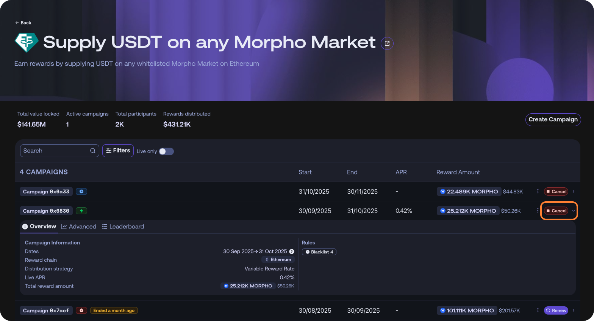
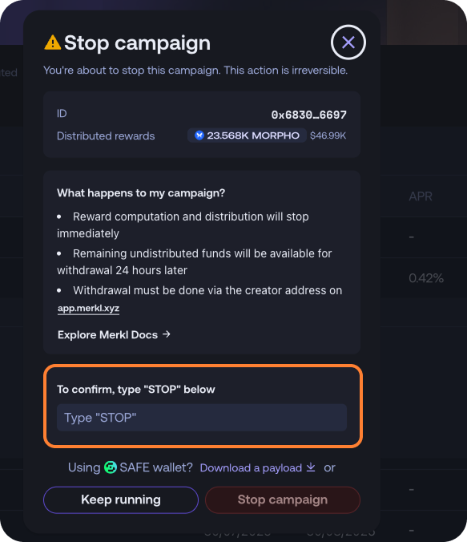

# Additional Features

Beyond campaign types, distribution methods, and customization options, Merkl offers several advanced features to enhance campaign flexibility and reward management.

## ❌ Blacklisting

Blacklisting excludes specific addresses from receiving rewards.

<figure><figcaption></figcaption></figure>


If a [forwarder](reward-forwarding.md) is blacklisted, all associated users are also ineligible.

Example of a staking contract blacklist:

* A user holds 10 USDA but has staked 6 USDA in a blacklisted staking contract (forwarder).
* Only the 4 USDA in the user’s wallet qualifies for rewards.


## ✅ Whitelisting

Whitelisting restricts rewards to a specific address or set of addresses (e.g., forwarders, or individual users).

Example of Uniswap V3 whitelisting:

* A campaign incentivizes LPs in a Uniswap V3 pool with three forwarders — here Automated Liquidity Managers.
* The campaign creator whitelists only two forwarders and one user address.
* Result:
  * Only liquidity providers using the two approved forwarders or the whitelisted user will receive rewards
  * Rewards are distributed normally among whitelisted addresses based on liquidity share.


**Whitelisting overrides blacklisting. If an address is whitelisted, all other addresses are automatically blacklisted.**



If multiple campaigns run on the opportunity (e.g. Uniswap v4 ETH-USDC), some may have whitelists while others do not. This means that, for the same opportunity, the users receiving rewards can differ.

Users should check the campaign details on the opportunity page to confirm eligibility requirements.


## 🔥 Run Multiple Campaigns on the Same Opportunity

Merkl allows multiple campaigns to be created simultaneously for the same pool or set of actions.

**Why is this useful?**

* Co-incentives: Different parties can independently add incentives to the same opportunity.
* Flexible Stacking: Multiple campaigns can run alongside each other on the same pool or token, supporting different incentive structures.

## ⏳ Campaigns of Any Duration

Merkl campaigns can run for any length of time, from as short as one hour to as long as six months (or more).

This flexibility allows for:

* Short-term boosts (e.g., flash incentives for new launches).
* Long-term, sustained incentive programs for ongoing ecosystem growth.

## 🎭 Infinite Customizability with Token Wrappers

Merkl campaigns can distribute tokens with custom properties, known as token wrappers, to introduce advanced incentive mechanisms.

**Examples of Token Wrapper Use Cases:**

* Vesting & Slashing Conditions: Add vesting schedules or penalties for early withdrawals.
* Non-Prefunded Campaigns: Instead of preloading tokens, rewards are pulled from a multisig when users claim.
* Time-Locked Transfers: Issue non-transferable tokens that unlock after a set period.
* Redeemable Tokens: Distribute placeholder tokens that can be redeemed later.

Merkl provides a suite of template contracts for token wrappers in the Merkl GitHub repository so anyone can build [its own token wrapper](https://github.com/AngleProtocol/merkl-contracts/tree/main/contracts/partners/tokenWrappers). Some templates have already been audited by Merkl partners!


Got a custom use case? Let us know—we’re happy to collaborate and help build your solution.


## 🌍 Cross-Chain Campaigns

Merkl allows you to incentivize activity on one chain while distributing rewards on another.

**How It Works:**

* Activity is tracked on Chain A (e.g., a protocol running on Arbitrum).
* Rewards remain claimable on Chain B (e.g., distributed token stays on Ethereum): the chain where the token is claimable is the chain where the campaign was created

**Why is this useful?**

* Efficient token management: Keeps governance tokens on a single chain, reducing the need for bridging.
* Cross-chain flexibility: Supports protocols that operate on multiple chains without fragmenting incentives.

<figure><figcaption><p>Rewards sent on a different chain than the one where users perform the action to be eligible</p></figcaption></figure>

**Important considerations**:

Some smart contracts on the chain you are incentivizing activity may not exist on the chain where users can claim their reward (or may exist at a different address):

* Affected addresses will be unable to claim rewards in this case
* Solution: As an campaign creator, you should blacklist any ineligible addresses to prevent reward loss. Or you can reallocate rewards (more below) of addresses that cannot claim to an address controlled by the same provider that can claim its rewards

## 🔄 Campaign Reallocation

As a campaign creator, you can reallocate unclaimed rewards from any recipient address to another address at your discretion. This gives you full control over reward distribution, especially when certain addresses cannot claim their rewards.

Once a campaign has ended, campaign creators can reallocate unclaimed rewards from any recipient to another address at their discretion. Campaign creators can also reallocate all unclaimed rewards at once.

To give users time to claim their rewards, reallocation is only available after a defined window following the campaign's end. Currently, this window ranges from 1 day to 7 months post-campaign.

When reallocation is triggered, the process can take up to 24 hours. This delay is due to required security checks and the need to publish a Merkle root onchain—an essential step for making the reallocated rewards claimable. Since Merkle root updates do not occur continuously or in real time, this contributes to the delay.

Once the reallocation is complete and the Merkle root is updated on the relevant chain, the new rewards can be claimed just like any other Merkl reward, using the address to which they were reassigned.

### Use Cases

* Smart contracts without claim functions that need rewards redirected to claimable addresses
* Lost wallets or inaccessible addresses
* One-time partner facilitation (redirecting from contract addresses to partner wallets)
* No fees are charged for reallocations.

Campaign creators can perform reallocations either through the [Merkl Studio](https://studio.merkl.xyz/users/) interface or programmatically via the smart contract.

**How to reallocate rewards:**

Call the `reallocateCampaignRewards` function on the Campaign Creator contract:

```solidity
function reallocateCampaignRewards(
    bytes32 _campaignId,
    address[] memory froms,
    address to
)
```

**Parameters:**

* `_campaignId`: The campaign ID for reallocation
* `froms`: Array of addresses to reallocate from (use `["0x0000000000000000000000000000000000000000"]` to reallocate all unclaimed rewards)
* `to`: The destination address

**Example transaction payload** (for use with Safe Transaction Builder):

When reallocating from the same address across multiple campaigns, create multiple transactions in your Safe batch—one for each campaign ID:

[Download example payload file](../.gitbook/assets/reallocation-payload-example.json)

This example shows how to batch reallocations from the same source address to the same destination address across multiple campaigns. Simply add more transaction objects to the `transactions` array for additional campaigns.

**Important considerations:**

* Reallocation can take up to 24 hours to complete due to security checks and processing
* Reallocation operations are free—no fees are charged
* Each campaign must be reallocated separately (but can be batched in a single Safe transaction)

**Developer:**

To reallocate rewards, you need to call from the creator address [reallocateCampaignRewards](https://github.com/AngleProtocol/merkl-contracts/blob/1006c8ff64ba3eb4732a19da3cec92d4afc92eb8/contracts/DistributionCreator.sol#L285) on the Campaign Creator (Smart contract addresses [here](../integrate-merkl/smart-contract-addresses.md)) with parameters:

* \_campaignId: the campaign ID you want to reallocate unclaimed rewards for
* froms: An array of addresses that you want to reallocate from
* to: the address that should receive the reallocated rewards

To reallocate all unclaimed rewards, you can set `froms` to `[0x0000000000000000000000000000000000000000]`.

## 🛑 Campaign Cancellation

Cancel a campaign by opening the [Studio](https://studio.merkl.xyz/users/) and sign in with the creator address. If you only need the cancellation transaction payload (e.g., for a Safe), you may impersonate the creator address to fetch it.

Step 1: From the Opportunities list, open the opportunity that contains your campaign.

<figure><figcaption></figcaption></figure>

Step 2: Select the campaign, and click Cancel on the right.

<figure><figcaption></figcaption></figure>

Step 3: Confirm the action by typing STOP when prompted. You can then execute the cancellation transaction. If you prefer to execute via a Safe, download the payload and drag and drop on Safe transaction builder.

<figure><figcaption></figcaption></figure>

Once cancelled, the campaign stops accruing rewards immediately. Any undistributed tokens become withdrawable within **24 hours** - either from the Merkl UI or directly by calling the contract.


Cancellation is **irreversible**. The engine will not process further updates for this campaign after cancellation, and previously processed distributions remain final.


## ✏️ Campaign Overrides

Merkl allows campaign creators to modify an active campaign by adding extra customization options, such as:

* Adjusting blacklists or whitelists to include or exclude certain addresses.
* Enabling additional features as needed.
* Ending a campaign early if necessary

❌ What you cannot do :

* Change the reward token
* Change the end date of the campaign to a date in the past
* For variable APR campaigns, you cannot change the total amount distributed.

## ◀️ Retroactive Campaigns

You can create campaigns in the past to reward OG users. It can start and end in the past or it can end in the future.
