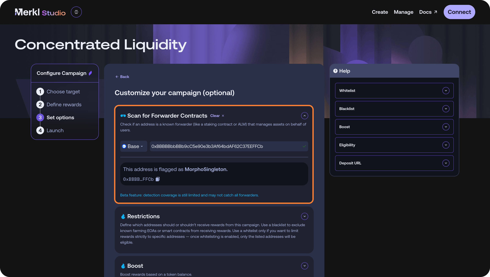
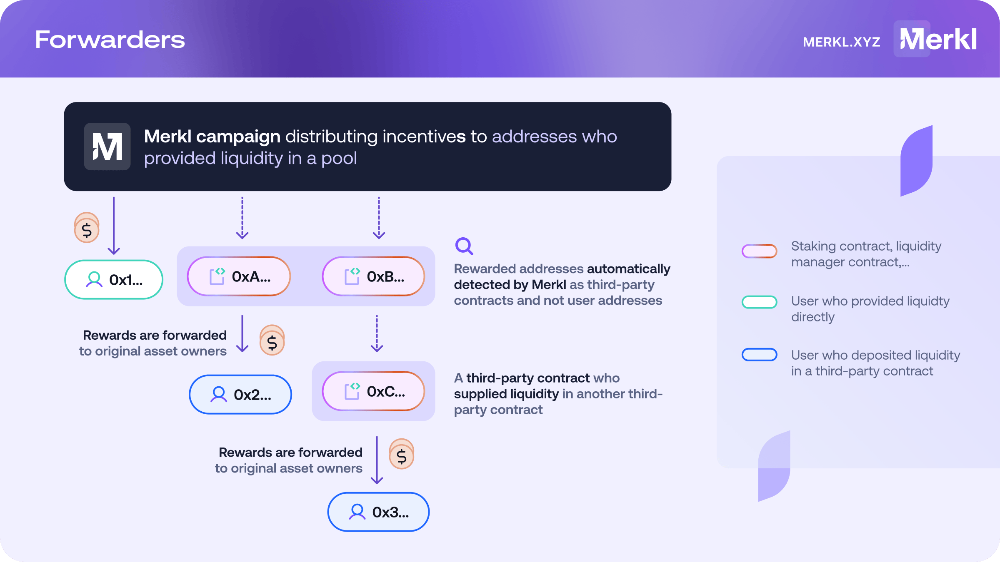

# Additional Features

Beyond campaign types, distribution methods, and customization options, Merkl offers several advanced features to enhance campaign flexibility and reward management.

## 🔁 Forwarders

Merkl Engine intelligently enables users to **earn rewards even when they don’t hold the incentivized asset directly in their wallet**. For example, in a campaign rewarding token holders, many users may have their tokens staked in a contract. If Merkl has integrated that staking contract, those users will still receive rewards based on their staked amount.

This mechanism—tracking indirect ownership across contracts and protocols—is handled by Merkl forwarders. Forwarders allow Merkl to distribute rewards to users holding an incentivized asset indirectly, such as through staking contracts or LP tokens. By default, Merkl supports forwarding for most major DeFi protocols.

In most [campaign types](../mechanisms/hooks/mechanisms/), Merkl automatically detects and applies any integrated forwarders. However, for older, legacy campaigns (e.g., the original ERC20 campaign type), forwarders must be manually specified at the time of campaign creation.

<figure><figcaption>
The forwarder scan in Merkl Studio
</figcaption></figure>

**How It Works**:

* **Complexity Varies**: While for some simple forwarders, such as staking contracts for ERC20 tokens, the integration and forwarding process is relatively straightforward, some are equivalent to a complex integration of a new protocol type, and imply forwarding rewards across several stakeholders on multiple smart contract layers.
* **Auto-Detection**: Once a forwarder is integrated, it’s automatically applied—no manual configuration is needed. The Merkl frontend includes a scan tool to check if an address matches any known forwarder patterns.
* **Protocol Fidelity**: Merkl mirrors the logic of each protocol. For example, if a protocol charges a fee on accrued rewards, Merkl will automatically account for and replicate that fee in the reward forwarding process.

<figure><figcaption></figcaption></figure>

**Example 1: Staked Token Rewards**:

* A campaign incentivizes USDA holders.
* Users who staked USDA and received stUSD would normally be ineligible for rewards because they don't hold the USDA directly in their wallet.
* As forwarding is automatically enabled, Merkl recognizes stUSD holders as USDA holders and distributes rewards accordingly.

**Example 2: Morpho Rewards**:

* A campaign targets USDA holders.
* USDA is used across multiple Morpho markets, either as collateral or loan token.
* Merkl detects the Morpho singleton as a forwarder, automatically distributes the USDA rewards among relevant stakeholders across all markets, proportionate to their contribution to the singleton’s USDA holdings.

**Example 3: Pendle Rewards**:

* A campaign rewards USDA holders.
* USDA is deposited into a Pendle market.
* Merkl forwards rewards only to eligible Pendle stakeholders (YT and LP token holders), excluding PT holders, and applies the Pendle treasury fee per protocol rules.

**How to Enable Forwarding**:

Forwarding is enabled by default for most campaign types on Merkl. If your campaign requires integration with a new forwarder or support for a different protocol, please contact our team.

To ensure efficient distribution, Merkl enforces a minimum distribution threshold for each reward token. Campaigns can only be created if the token amount meets or exceeds this threshold. The same rule applies to forwarding: rewards are only forwarded if they pass the threshold.

Forwarding will not be enabled for an address if the total rewards over a given period fall below the minimum per-hour threshold for that token. For example, if an ERC20 vault receives just $0.01 of rewards in a day and the token’s threshold is $0.10 per hour, those rewards will not be forwarded. Instead, they’ll remain accrued at the vault address.


Coming soon: When creating a campaign, you’ll be able to specify that an address is an ERC20 token—enabling automatic forwarding to its token holders.


## ❌ Blacklisting

Blacklisting excludes specific addresses from receiving rewards.

<figure><figcaption></figcaption></figure>


If a [forwarder](features.md#forwarders) is blacklisted, all associated users are also ineligible.

Example of a staking contract blacklist:

* A user holds 10 USDA but has staked 6 USDA in a blacklisted staking contract (forwarder).
* Only the 4 USDA in the user’s wallet qualifies for rewards.


## ✅ Whitelisting

Whitelisting restricts rewards to a specific address or set of addresses (e.g., forwarders, or individual users).

Example of Uniswap V3 whitelisting:

* A campaign incentivizes LPs in a Uniswap V3 pool with three forwarders — here Automated Liquidity Managers.
* The campaign creator whitelists only two forwarders and one user address.
* Result:
  * Only liquidity providers using the two approved forwarders or the whitelisted user will receive rewards
  * Rewards are distributed normally among whitelisted addresses based on liquidity share.


**Whitelisting overrides blacklisting. If an address is whitelisted, all other addresses are automatically blacklisted.**



If multiple campaigns run on the opportunity (e.g. Uniswap v4 ETH-USDC), some may have whitelists while others do not. This means that, for the same opportunity, the users receiving rewards can differ.

Users should check the campaign details on the opportunity page to confirm eligibility requirements.


## 🔥 Run Multiple Campaigns on the Same Opportunity

Merkl allows multiple campaigns to be created simultaneously for the same pool or set of actions.

**Why is this useful?**

* Co-incentives: Different parties can independently add incentives to the same opportunity.
* Flexible Stacking: Multiple campaigns can run alongside each other on the same pool or token, supporting different incentive structures.

## ⏳ Campaigns of Any Duration

Merkl campaigns can run for any length of time, from as short as one hour to as long as six months (or more).

This flexibility allows for:

* Short-term boosts (e.g., flash incentives for new launches).
* Long-term, sustained incentive programs for ongoing ecosystem growth.

## 🎭 Infinite Customizability with Token Wrappers

Merkl campaigns can distribute tokens with custom properties, known as token wrappers, to introduce advanced incentive mechanisms.

**Examples of Token Wrapper Use Cases:**

* Vesting & Slashing Conditions: Add vesting schedules or penalties for early withdrawals.
* Non-Prefunded Campaigns: Instead of preloading tokens, rewards are pulled from a multisig when users claim.
* Time-Locked Transfers: Issue non-transferable tokens that unlock after a set period.
* Redeemable Tokens: Distribute placeholder tokens that can be redeemed later.

Merkl provides a suite of template contracts for token wrappers in the Merkl GitHub repository so anyone can build [its own token wrapper](https://github.com/AngleProtocol/merkl-contracts/tree/main/contracts/partners/tokenWrappers). Some templates have already been audited by Merkl partners!


Got a custom use case? Let us know—we’re happy to collaborate and help build your solution.


## 🌍 Cross-Chain Campaigns

Merkl allows you to incentivize activity on one chain while distributing rewards on another.

**How It Works:**

* Activity is tracked on Chain A (e.g., a protocol running on Arbitrum).
* Rewards remain claimable on Chain B (e.g., distributed token stays on Ethereum): the chain where the token is claimable is the chain where the campaign was created

**Why is this useful?**

* Efficient token management: Keeps governance tokens on a single chain, reducing the need for bridging.
* Cross-chain flexibility: Supports protocols that operate on multiple chains without fragmenting incentives.

<figure><figcaption>
Rewards sent on a different chain than the one where users perform the action to be eligible
</figcaption></figure>

**Important considerations**:

Some smart contracts on the chain you are incentivizing activity may not exist on the chain where users can claim their reward (or may exist at a different address):

* Affected addresses will be unable to claim rewards in this case
* Solution: As an campaign creator, you should blacklist any ineligible addresses to prevent reward loss. Or you can reallocate rewards (more below) of addresses that cannot claim to an address controlled by the same provider that can claim its rewards

## 🔄 Campaign Reallocation

Once a campaign has ended, campaign creators can reallocate unclaimed rewards from any recipient to another address at their discretion.

Campaign creators can also reallocate all unclaimed rewards at once.

To give users time to claim their rewards, reallocation is only available after a defined window following the campaign’s end. Currently, this window ranges from 1 day to 7 months post-campaign.

When reallocation is triggered, the process can take up to 24 hours. This delay is due to required security checks and the need to publish a Merkle root onchain—an essential step for making the reallocated rewards claimable. Since Merkle root updates do not occur continuously or in real time, this contributes to the delay.

Once the reallocation is complete and the Merkle root is updated on the relevant chain, the new rewards can be claimed just like any other Merkl reward, using the address to which they were reassigned.

**Use Case:**

* Useful for redirecting rewards from addresses that cannot claim them (e.g., lost wallets, smart contracts without claim functions).
* No fees are charged for reallocations.

**Developer:**

To reallocate rewards, you need to call from the creator address [reallocateCampaignRewards](https://github.com/AngleProtocol/merkl-contracts/blob/1006c8ff64ba3eb4732a19da3cec92d4afc92eb8/contracts/DistributionCreator.sol#L285) on the Campaign Creator (Smart contract addresses [here](../integrate-merkl/smart-contract-addresses.md)) with parameters:

* \_campaignId: the campaign ID you want to reallocate unclaimed rewards for
* froms: An array of addresses that you want to reallocate from
* to: the address that should receive the reallocated rewards

To reallocate all unclaimed rewards, you can set `froms` to `[0x0000000000000000000000000000000000000000]`.

## ✏️ Campaign Overrides

Merkl allows campaign creators to modify an active campaign by adding extra customization options, such as:

* Adjusting blacklists or whitelists to include or exclude certain addresses.
* Enabling additional features as needed.
* Ending a campaign early if necessary

❌ What you cannot do :

* Change the reward token
* Change the end date of the campaign to a date in the past
* For variable APR campaigns, you cannot change the total amount distributed.

## ◀️ Retroactive Campaigns

You can create campaigns in the past to reward OG users. It can start and end in the past or it can end in the future.

## 🏛️ Onchain Governance System Integrations

Merkl supports onchain governance-driven incentives, allowing protocols to automatically issue incentives through Merkl based on governance vote outcomes.

For protocols using gauge systems:

* Merkl provides ready-to-use smart contracts to plug into any gauge system.
* These connectors automatically translate governance votes into highly customizable Merkl campaigns. Our Governance Plug-in Templates are available [here](https://github.com/AngleProtocol/merkl-contracts/tree/main/contracts/partners/middleman).


Need help integrating Merkl with your onchain reward system? We’re here to assist—reach out for guidance! We've also got a detailed guide for this available [here](../distribute-with-merkl/deploy-your-campaign-from-dao.md).

