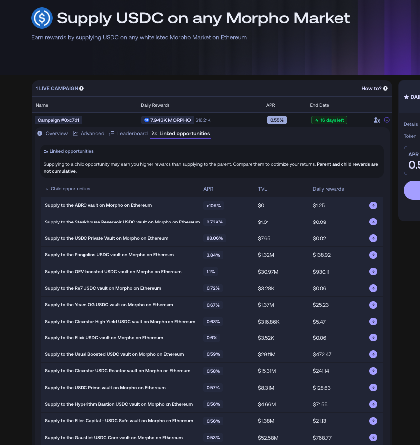
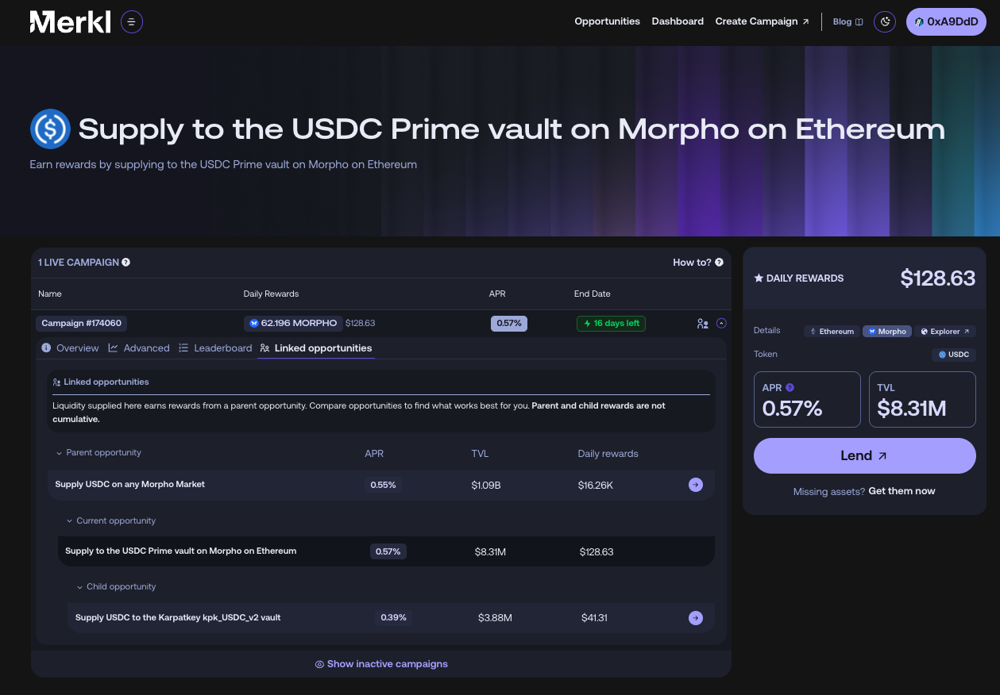

# Reward Forwarding

Merkl Engine intelligently enables users to **earn rewards even when they don't hold the incentivized asset directly in their wallet**. For example, in a campaign rewarding token holders, many users may have their tokens staked in a contract. If Merkl has integrated that staking contract, those users will still receive rewards based on their staked amount.

This process of allocating rewards to the end users rather than to the contract itself is called forwarding, and the smart contract holding incentivized asset on behalf of users is referred to in this case as a **a Merkl forwarder**.

## How It Works

In most [campaign types](../mechanisms/hooks/mechanisms/), Merkl automatically detects and applies any integrated forwarding logic.

<figure><figcaption>
The forwarder scan in Merkl Studio
</figcaption></figure>


Check whether a contract is recognized as a forwarder by Merkl at https://forwarders.merkl.xyz/


**Key characteristics:**

* **Complexity Varies**: While some simple forwarders, such as staking contracts for ERC20 tokens, have straightforward integration and forwarding processes, others are equivalent to a complex protocol integration and involve forwarding rewards across multiple stakeholders on several smart contract layers.
* **Auto-Detection**: Once a forwarder is integrated, it's automatically applied—no manual configuration is needed. The Merkl frontend includes a scan tool to check if an address matches any known forwarder patterns.
* **Protocol Fidelity**: Merkl mirrors the logic of each protocol. For example, if a protocol charges a fee on accrued rewards, Merkl will automatically account for and replicate that fee in the reward forwarding process.

<figure><figcaption></figcaption></figure>

## Examples

**Example 1: Staked Token Rewards**:

* A campaign incentivizes USDA holders.
* Users who staked USDA and received stUSD would normally be ineligible for rewards because they don't hold USDA directly in their wallet.
* As forwarding is automatically enabled, Merkl recognizes stUSD holders as indirect USDA holders and distributes rewards accordingly.

**Example 2: Morpho Rewards**:

* A campaign targets USDA holders.
* USDA is used across multiple Morpho markets, either as collateral or loan token.
* Merkl detects the Morpho singleton as a forwarder and automatically distributes the USDA rewards among relevant stakeholders across all markets, proportionate to their contribution to the singleton's USDA holdings.

**Example 3: Pendle Rewards**:

* A campaign rewards sUSDe holders.
* Merkl rewards sUSDe "spot" holders and forwards rewards only to eligible Pendle stakeholders (YT and LP token holders), excluding PT holders, while applying the standard Pendle treasury fee.

## Linked Opportunities

When Merkl detects an address as a forwarder, it automatically creates a **subcampaign** that can be tracked within the associated opportunity. This creates what we call on the app **linked opportunities**—DeFi opportunities connected by liquidity flows, where one opportunity (the child) deposits funds into another (the parent) and receives rewards from it.

For example, a vault managing user funds (child opportunity) may deposit liquidity into a Uniswap pool (parent opportunity) that has active Merkl campaigns. When Merkl detects the vault as a forwarder, it creates a subcampaign visible on the vault's opportunity page. Thanks to this reward forwarding system, participants in the child opportunity—who are indirectly participating in the parent opportunity—receive rewards from the parent campaigns, in addition to any direct Merkl rewards from campaigns on the child opportunity itself.

Linked opportunities are displayed in the Merkl App to help users understand the full reward potential of their deposits and make informed decisions about where to allocate liquidity.

**Important note about subcampaign/linked opportunity visibility:** Subcampaigns are only created after the Merkl engine has completed its first computation cycle on the main campaign. This means that immediately after a campaign is created, the API cannot report any subcampaigns or linked opportunities, even though the engine will process them once the first compute runs. For example, if you renew a campaign, the new campaign will initially show no APR on linked opportunities right after it starts, even though the previous campaign displayed this information. The linked opportunities and their APRs will appear once the first engine computation completes.

### Example of linked opportunities:
When the Merkl Engine runs a campaign’s calculations, it scans for smart contracts it recognizes (e.g., vaults) to avoid distributing to smart contracts directly. If any are detected, the Merkl Engine creates child campaigns accordingly. In the below example, the main campaign incentivizes USDC supply across all whitelisted Morpho markets on Ethereum.
<figure><figcaption></figcaption></figure>

Each child campaign has its own APR, determined by the vault’s allocation to the whitelisted Morpho markets. You can click any child opportunity to view the APR associated with this child campaign and check whether other campaigns are stacked on top of this opportunity.
<figure><figcaption></figcaption></figure>

It’s also possible for a child campaign to have its own children. In this example, because the Prime Vault sources a part of its liquidity from Karpathkey Morpho Vault V2, the Merkl Engine creates an additional child campaign for that flow.

## Enabling Forwarding

Forwarding is enabled by default for most campaign types on Merkl. If your campaign requires integration with a new forwarder or support for a different protocol, please contact our team.

To ensure efficient distribution, Merkl enforces a minimum distribution threshold for each reward token. Campaigns can only be created if the token amount meets or exceeds this threshold. The same rule applies to forwarding: rewards are only forwarded if they pass the threshold.

Forwarding will not be enabled for an address if the total rewards over a given period fall below the minimum per-hour threshold for that token. For example, if an ERC20 vault receives just $0.01 of rewards in a day and the token's threshold is $0.10 per hour, those rewards will not be forwarded. Instead, they'll remain accrued at the vault address.

## Address Remapping

If you're earning rewards through a smart contract that cannot claim them (e.g., non-upgradeable contracts on Uniswap V4 that cannot call `toggleOperator` or transfer), you may need **address remapping** to redirect your rewards to a claimable address.

**Remapping vs. Forwarding:**

While both mechanisms redirect rewards, they serve different purposes:

* **Forwarding** (described above) automatically distributes rewards to users who hold the incentivized asset indirectly through integrated protocols (e.g., staking contracts or LP tokens). Forwarding works at the protocol level and is integrated directly into Merkl's reward distribution logic.
* **Address remapping** is a manual configuration set up by the Merkl team that redirects rewards from one specific address (your contract) to another specific address (your claimable wallet). It's used when a contract receives rewards but cannot claim them, and you want those rewards sent to a claimable address for the entire campaign duration.

**How to request address remapping:**

Contact the Merkl team via [Discord](https://discord.com/channels/1209830388726243369/1210212731047776357) with:

* Your campaign ID(s)
* The source address (contract) from which rewards should be redirected
* The destination address (claimable wallet) where rewards should be sent


Address remapping is particularly useful for long-running campaigns where you expect regular reward accumulation on addresses that cannot claim. Rather than performing frequent manual reallocations, remapping provides a seamless, automated solution.

